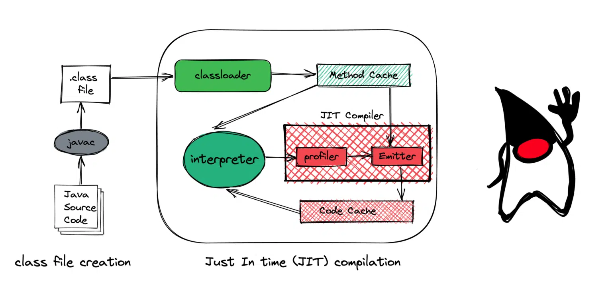

# Just-in-time compiler

为了实现 `一次编译，处处运行`，`java` 把编译的过程分成两部分，首先它会先由 `javac` 编译成通用的中间形式——字节码，然后再由解释器逐条将字节码解释为机器码来执行

javac 将源码编译成字节码，在这个过程中会进行`词法分析`、`语法分析`、`语义分析`，编译原理中这部分的编译称为前端编译。接下来无需编译直接逐条将字节码解释执行，在解释执行的过程中，虚拟机同时对程序运行的信息进行收集，在这些信息的基础上，编译器会逐渐发挥作用，它会进行后端编译——把字节码编译成机器码，但不是所有的代码都会被编译，只有被JVM认定为的热点代码，才可能被编译。

JVM中会设置一个阈值，当方法或者代码块的在一定时间内的调用次数超过这个阈值时就会被编译，存入codeCache中。当下次执行时，再遇到这段代码，就会从codeCache中读取机器码，直接执行，以此来提升程序运行的性能。整体的执行过程大致如下图所示：
