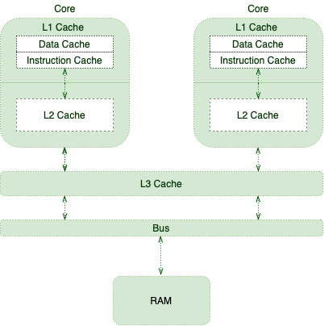

# QA

## Volatile

> **answer in** [stackoverflow](https://stackoverflow.com/questions/106591/what-is-the-volatile-keyword-useful-for)

- Shared Multiprocessor Architectur



`volatile` has semantics for memory visibility. Basically, the value of a volatile field becomes visible to all readers (other threads in particular) after a write operation completes on it. Without `volatile`, readers could see some non-updated value.

___

## How does  `compare and set` in `AtomicInteger` works

>  **answer in** [stackoverflow](https://stackoverflow.com/questions/32634280/how-does-compare-and-set-in-atomicinteger-works)

`AtomicInteger` works with two concepts: `CAS` and `volatile` variable.

Using `volatile` variable insures that the current value will be visible to all threads and it will not be cached.

But I am confused over CAS（compare AND set）concept which is explained below:

```java
public final int getAndIncrement() {
    for (;;) {
        int current = get();
        int next = current + 1;
        if (compareAndSet(current, next))
            return current;
    }
 }
```

My question is that what if `compareAndSet(current, next` returns false? Will the value not be updated? In this case what will happen when a Thread is executing the below case:

```java
private AtomicInteger count = new AtomicInteger();
count.incrementAndGet();
```


The atomic objects make use of [Compare and Swap mechanism](https://www.wikiwand.com/en/Compare-and-swap) to make them atomic - i.e. it is possible to guarantee that the value was as specified and is now at the new value.

The code you posted continually tries to set the current value to one more than it was before. Remember that another thread could also have performed a get and is trying to set it too. If two threads race each other to change the value it is possible for one of the increments to fail.

Consider the following scenario:

- Thread 1 calls get and gets the value 1.
- Thread 1 calculates next to be 2.
- Thread 2 calls get and gets the value 1.
- Thread 2 calculates next to be 2.
- Both threads try to write the value.

Now because of atomics - **only one thread will succeed**, the other will recieve false from the compareAndSet and go around again.

If this mechanism was not used it would be quite possible for both threads to increment the value resulting in only one increment actually being done.

The confusing infinite loop `for(;;)` will only really loop if many threads are writing to the variable at the same time. Under very heavy load it may loop around several times but it should complete quite quickly.

