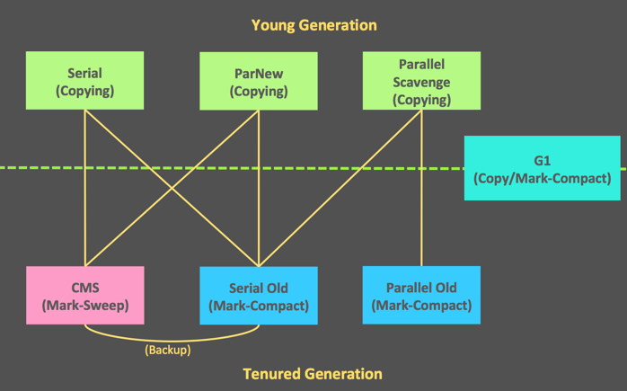

# GC

## ParNEW

> 并行垃圾回收器，主要用于对年轻代进行垃圾回收。使用了多线程并行的方式进行垃圾回收，能够充分利用多核CPU的性能优势，提高垃圾回收的效率。同时，ParNew也采用了复制算法（`COPYING`），将年轻代分成两个等大小的区域，一块区域存活的对象会被复制到另外一块区域中，而不需要进行标记和清除操作。

1. `-XX:ParallelGCThreads（并行线程数）`：默认情况下，ParNew使用的线程数与CPU核心数相同。如果应用程序对CPU的占用较高，可以适当降低线程数，以减少垃圾回收对应用程序的影响。

2. `-XX:NewRatio（新生代与老年代的比值）`：建议将年轻代的大小设置为整个堆空间的`1/3`到`1/4`左右。

3. 对象存活率：`ParNew` 垃圾回收器采用复制算法，存活的对象会被复制到另外一个区域中。因此，对象的存活率对垃圾回收的性能有很大影响。如果对象的存活率较高，将会导致大量的复制操作，从而影响垃圾回收的效率。

## CMS (Concurrent Mark and Sweep)

> 采用 “`标记-清除（Mark and sweep）`” 算法，主要针对`老年代`的垃圾回收，GC 过程可以和应用程序同时运行，减少了应用程序的停顿时间，从而提高了应用程序的响应性能。但是，由于 `CMS` 需要和应用程序共享 `CPU` 和 内存资源，某些情况下会对应用程序的性能产生影响（并发收集、低停顿）

1. `初始标记（老生代使用比率超过某值）`：停止应用程序的执行，适用 `STW` 机制标记所有的根对象，记录需要回收的对象
2. `并发标记`：初始标记之后，CMS 和应用程序同时运行，标记所有需要回收的对象。在该阶段，由于应用程序可能会不断创建新的对象，因此 CMS 需要动态地跟踪需要回收的对象

3. `重新标记`：并发标记阶段结束后， CMS 再次停止应用程序的执行，使用 `STW` 重新标记被修改的对象，由于此次标记范围比较小，因此速度比较快
4. `并发清除`：和应用程序同时运行，清楚需要回收的对象

> 存在问题：

（1）对CPU资源非常敏感
（2）无法处理浮动垃圾(`Floating Garbage`), 浮动垃圾指的是一些对象当前可能是存在引用的, 而在并发标记
    的过程中失去了引用, 但是该对象在垃圾回收器看来仍然是存活的, 即本次垃圾回收不会回收这些对象, 只
    能等下一次垃圾回收了, 可能出现 `Concurrent Mode Failure` （判定为老年代空间不足）而导致另一
    次 `Full GC` 的产生
