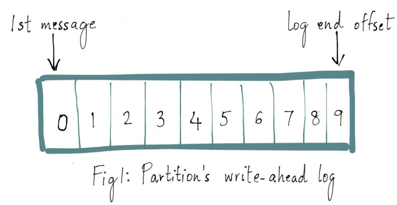
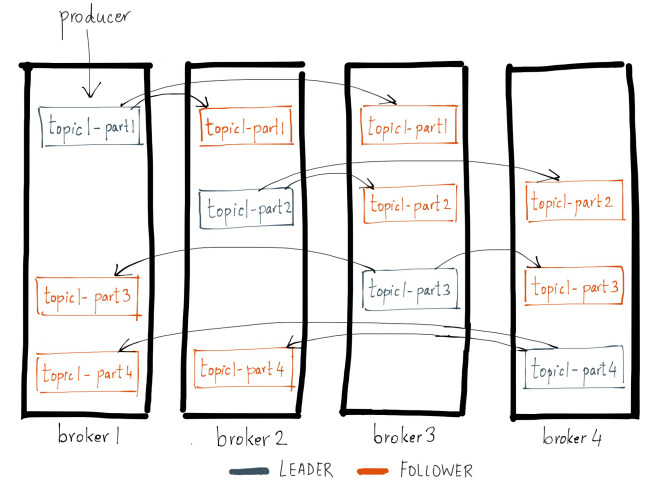

# QA

## Kafka 的消息可靠性策略

### `1 Topic 分区副本` - **副本间的消息状态一致性**

    
     
    
WAL (Write-Ahead Log)

`Kafka` `topic` 中的每个分区都有一个预写日志（`write-ahead log`），写入 `Kafka` 的消息就存储在这里面。这里面的每条消息都有一个唯一的偏移量，用于标识它在当前分区日志中的位置

    
     
    
Leader同步Follower

> ISR in-sync replica

    
     
    
ISR：和Leader保持同步的Follower副本

注：判断副本是否和 `Leader` 同步：
- `Leader` 允许 `ISR` 落后的消息数：`replica.lag.max.messages`
- `Follower` 在不超过 `replica.lag.time.max.ms` 时间内向 `Leader` 发送 `fetch` 请求

> `Leader` 选举如何保证可靠性？

- `Leader` **crash** 时，`Kafka`会从`ISR`列表中选择第一个`Follower`作为新的`Leader`，`follower`分局拥有最新的已经 `committed` 的消息。通过这个可以保证已经 `committed` 的消息的数据可靠性

___

### 2 `Producer 消息确认机制`

> **`ack = 0`**：`Producer`通过网络把消息发出去，则认为消息已成功写入Kafka

- 序列化失败，分区离线或整个集群长时间不可用，生产者均不会收到任何错误
- 速度快，但无法保证`server`能收到消息

> **`default:ack = 1`**：`Leader`收到消息并写入分区文件时返回确认或错误响应

- 消息在写入`Leader`，`Follower`写入之前`Leader`奔溃，则消息丢失

> **`可用性保证：ack = -1`**：Leader在所有`Follower`收到消息后，才返回确认或错误响应

- 配置 `replication.factor` 副本数

## 参考

- [1] [Hands-Free Kafka Replication: A Lesson in Operational Simplicity](https://www.confluent.io/blog/hands-free-kafka-replication-a-lesson-in-operational-simplicity/)

- [2] [Kafka 是如何保证数据可靠性和一致性](https://cloud.tencent.com/developer/article/1488458)

- [3] [如何理解Kafka的消息可靠性策略？](https://zhuanlan.zhihu.com/p/302704003)
