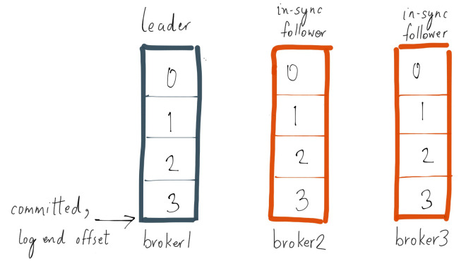

# QA

## Kafka 的消息可靠性策略

> 从三个方面分析：

- Topic 分区副本`数据一致性`
- 生产者`消息确认机制`
- 消费者`提交机制`

### 1 `Topic 分区副本` - 副本间的消息状态一致性

> `副本间数据同步`


<center>
    <div style="color:orange; border-bottom: 1px solid #d9d9d9;
    display: inline-block;
    color: #999;
    padding: 2px;">leader 同步 follower</div>
</center>

- `Kafka` 中的每个主题分区都被复制了 `n` 次，其中的 `n` 是 `topic` 的 `replication factor`。这允许 `Kafka` 在集群服务器发生故障时自动切换到这些副本，以便在出现故障时消息仍然可用。`Kafka` 的复制是以 `partition` 为粒度的，分区的预写日志被复制到 `n` 个服务器。 在 `n` 个副本中，一个副本作为 `leader`，其他副本成为 `followers`。顾名思义，`producer` 只能往 `leader` 分区上写数据（读也只能从 `leader` 分区上进行），`followers` 只按顺序从 `leader` 上复制日志。

> `ISR in-sync replica` 同步副本列表


<center>
    <div style="color:orange; border-bottom: 1px solid #d9d9d9;
    display: inline-block;
    color: #999;
    padding: 2px;">ISR：和Leader保持同步的follower副本</div>
</center>

- 日志复制算法（`log replication algorithm`）必须提供的基本保证是，如果它告诉客户端消息已被提交，而当前 `leader` 出现故障，新选出的 `leader` 也必须具有该消息。在出现故障时，`Kafka` 会从挂掉 `leader` 的 `ISR` 里面选择一个 `follower` 作为这个分区新的 `leader` ；换句话说，是因为这个 `follower` 是跟上 `leader` 写进度的。

- 每个分区的 leader 会维护一个 `in-sync replica`（同步副本列表，又称 ISR）。当 `producer` 往 `broker` 发送消息，消息先写入到对应 `leader` 分区上，然后复制到这个分区的所有副本中。只有将消息成功复制到所有同步副本（`ISR`）后，这条消息才算被提交。由于消息复制延迟受到最慢同步副本的限制，因此快速检测慢副本并将其从 `ISR` 中删除非常重要。 

!!! note 判断是否将follower从ISR移除

	```markdown
	- leader 允许 ISR 落后的消息数：replica.lag.max.messages （已废弃）
	- follower 在不超过 replica.lag.time.max.ms 时间内向 leader 发送 fetch 请求
	- 不同步的 follower 会从 ISR 中移除
	```

> `High Water` 机制，选择 `ISR` 中偏移量最小的分区


<center>
    <div style="color:orange; border-bottom: 1px solid #d9d9d9;
    display: inline-block;
    color: #999;
    padding: 2px;">HW</div>
</center>

**Q：如何保证分区间数据一致性？**

A： `leader` **crash** 时，`Kafka` 会从 `ISR` 根据分区选择算法选择 `follower` 作为新的`Leader`，`follower`分区拥有最新的已经 `committed` 的消息。通过这个可以保证已经 `committed` 的消息的数据可靠性
___


### 2 `Producer 消息确认机制`

> **`ack = 0`**：`Producer`通过网络把消息发出去，则认为消息已成功写入Kafka

- 序列化失败，分区离线或整个集群长时间不可用，生产者均不会收到任何错误
- 速度快，但无法保证`server`能收到消息

> **`default:ack = 1`**：`Leader`收到消息并写入分区文件时返回确认或错误响应

- 消息在写入`Leader`，`Follower`写入之前`Leader`奔溃，则消息丢失

> **`可用性保证：ack = -1`**：Leader在所有`Follower`收到消息后，才返回确认或错误响应

- 异常情况下，当同步到所有`follower`前`leader` 奔溃，`producer`会重新发送

```yaml
request.required.acks:-1 # 当leader 同步到所有follower后，才会返回响应
unclean.leader.election.enable:false # 是否允许非同步副本参与leader选举
min.insync.replicas:${N/2+2} # 用于保证当前集群中处于正常同步状态的副本数量，当实际值小于配置值时，集群停止服务
```


### 3 `Consumer 可靠性策略`

> `enable.auto.commit:true`：

- consumer 收到消息后即返回给broker，如果消费异常，则内容丢失
___
> `enable.auto.commit:false`：

- consumer 处理流程后手动提交，如果未提交时发生重启，会导致重复消费（需实现幂等）
___

> `Exactly once`：....
___

## 参考


- [1] [Hands-Free Kafka Replication: A Lesson in Operational Simplicity](https://www.confluent.io/blog/hands-free-kafka-replication-a-lesson-in-operational-simplicity/)

- [2] [Kafka 是如何保证数据可靠性和一致性](https://cloud.tencent.com/developer/article/1488458)

- [3] [简单理解 Kafka 的消息可靠性策略](https://cloud.tencent.com/developer/article/1752150)

