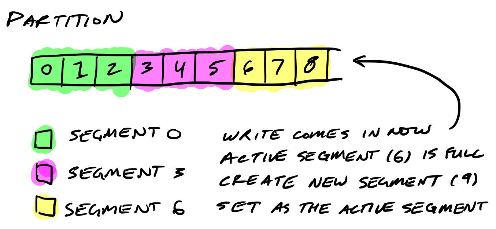
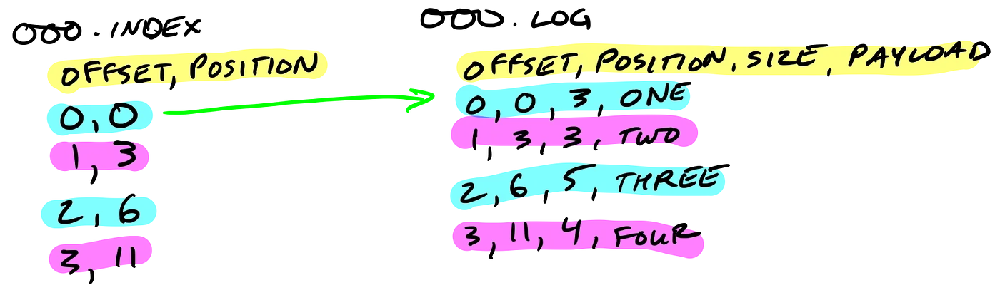

# kafka 存储结构

Kafka是一种高效、可扩展的分布式消息系统，其存储结构主要包括以下几个部分：

> `broker`

`Kafka` 集群中的节点，用于存储和处理消息。每个Broker可以存储多个分片 `Partition` 的消息，并通过 `Zookeeper` 协调集群中的节点。在 `Kafka` 中，分片是一个独立的、不可变的消息序列，它可以独立地被操作和维护。每个分片都会在多个 `Broker` 之间进行复制，以保证数据的可靠性和容错性。

> `topic`

`Kafka` 中消息的逻辑分类，类似于数据库中的表。每个 `Topic` 包含一个或多个分片，每个分片可以分布在不同的 `Broker` 上。在 `Kafka` 中，每个分片都是一个独立的、不可变的消息序列，其存储位置可以通过分片的编号来确定。

> `partition`

`Kafka` 中消息存储的最小单位，每个 `Partition` 包含一个不可变的、有序的消息序列，每个消息都有一个唯一的偏移量。`Partition` 是 `Kafka` 支持高并发和高吞吐量的关键，它可以被水平扩展，以支持更多的客户端并发读写操作。

> `segment`

（分段日志）`Kafka` 中 `Partition` 的物理存储单位，每个 `Segment` 包含一个独立的、不可变的消息序列，并以磁盘文件的形式存储。当 `Segment` 达到一定大小或时间限制时，Kafka会将其关闭并创建一个新的 `Segment`。每个 `Segment` 都有一个基本的索引文件，用于支持消息的快速查找和过滤。

> `offset`

`Offset` 是 `Kafka` 中消息在 `Partition` 中的唯一标识，每个消息都有一个唯一的偏移量。在Kafka中，每个 `Partition` 都有一个独立的偏移量，用于记录最后一个被消费的消息。客户端可以通过提交偏移量来记录已经消费的消息，以便在下一次启动时继续从上次停止的位置消费。

> `index`

`Index` 是 `Kafka` 中用于支持快速消息查找和过滤的数据结构，每个 `Segment` 都有一个基本的索引文件，用于支持消息的快速查找和过滤。`Kafka` 使用了基于 `Mmap` 的文件映射技术来实现高效的索引读写操作。

通过上述存储结构的组合，`Kafka` 实现了高效、可靠的消息传递和持久化，可以在高并发、高负载的场景下快速处理消息，并保证数据的可靠性和一致性。
