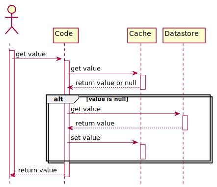
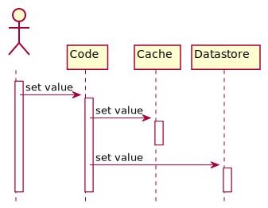
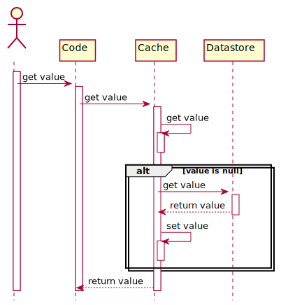
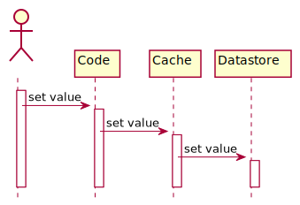
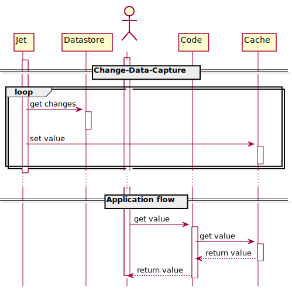

# Redis 缓存策略

## `Cache-Aside`

> 最常用的的缓存策略
___
> 适合 `读多` 的场景，如果 `Cache` 发生故障，可以直接访问 `Datastore` 进行操作
___
> 先更新 `datastore`，再更新 `Cache`
___
> 不能保证 `Cache` 和 `Datastore` 的一致性，需要配合使用其他策略更新缓存；另外，首次请求缓存无法命中，可以通过手动触发查询操作 `预热`

- `Cache Hit`: 从 `Cache` 中读取并返回客户端
- `Cache Miss`: 从 `Datastore` 读取，更新 `Cache` 并返回客户端

- 更新 `Cache` 和 `Datasource` 

## `Read-Through`

> `多次请求相同数据`的场景

> 将 `datastore` 的同步委托给 `Cache`,所有数据交互通过`Cache`完成

## `Write-Through`

## `Write-Behind`

> 使 `Cache` 的更新请求异步 `flush` 到 `datastore`

## `Refresh-Ahead`

> 主动预测，而非被动请求

## 参考

- [1] [A Hitchhiker’s Guide to Caching Patterns](https://hazelcast.com/blog/a-hitchhikers-guide-to-caching-patterns/)
