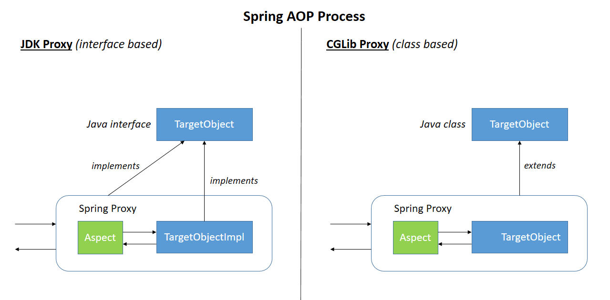

# AOP

## `1` terms and AOP concepts

> `Aspect` - a standard code/feature that is scattered across multiple places in the application and is typically different than the actual Business Logic (for example, Transaction management). Each aspect focuses on a specific cross-cutting functionality
___
> `Joinpoint` – it's a particular point during execution of programs like method execution, constructor call, or field assignment
___
> `Advice` – the action taken by the aspect in a specific joinpoint

___
> `Pointcut` – a regular expression that matches a joinpoint. Each time any join point matches a pointcut, a specified advice associated with that pointcut is executed
___

> `Weaving` – the process of linking aspects with targeted objects to create an advised object

## `2` Spring AOP and AspectJ

### `2.1` capabilities

> Spring AOP can only be applied to beans that are managed by a Spring container.

___

> AspectJ can applied across all domain objects.

### `2.2` Weaving

AspectJ makes use of three different tyeps of weaving:

- Compile-time weaving - takes as input both the source code of aspects and application and produces a woven class files as output.

- Post-compile weaving - It's used to weaving existing class file and jar files with aspects.

- Load-time weaving - Exactly like the former one, with a difference that weaving is postponed until a class loader loads the class file to the JVM.

Spring AOP use runtime weaving, the aspects are woven during the execution of the application using the proxies of the target object, using either `JDK dynamic proxy` or `CGLIB proxy`.

### `2.3` Structure

Whenever the targeted object implement one interface, then JDK dynamic proxy will be used. If the target object doesn't implement an interface, the CGLIB proxy will be used.

AspectJ on the hand doesn't do anything at runtime as the classes are compiled directly with the aspects.

### `2.4` Jointpoints

Spring AOP is based on proxy patterns. Because of this, it need to subclass the target class and apply the corss-cutting concerns accordingly.

We cannot apply cross-cutting concerns(aspects) accross class that are "final" because they cannot be overrided thus it would result in runtime exception.
The same applied for `static class` and `final methods`. Hence Spring AOP because of these limitations, can only support method execution joinpoints.

> It's also worth noting that Spring AOP, aspect aren't applied to the methods called within the same class.

:	That's obviously because when we call a method within the same class, then we aren't calling the method of the proxy that Spring supplies. If we need this functionality, we need to defind the method in different beans, or use AspectJ.