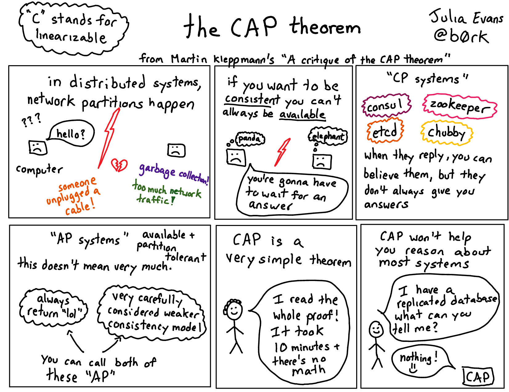

# CAP理论

> 一个分布式系统最多只能满足 `一致性（Consistency）`、`可用性（Availability）`、`分区容忍性（Partition tolorance）`三项中的两项；

    
A critique of the CAP theorem

> `一致性（Consistency）`

所有节点的数据应该保持一致，无论是读操作还是写操作。这意味着在任何时候，系统中的每个节点都具有相同的数据副本。

> `可用性（Availability）`

所有节点应该始终处于可用状态，以便客户端可以随时访问系统。这意味着系统需要尽可能快地响应客户端的请求。

> `分区容错性（Partition Tolerance）`

在分布式系统中，节点之间可能发生分区，即节点之间的通信中断。系统需要能够容忍这种情况，并继续提供一致性和可用性。

由于分区容错性是分布式系统中不可避免的问题，因此在 `CAP` 中，只能同时保证一致性和可用性中的其中两个。这是由于在分区时，无法同时保证所有节点的数据都是一致的同时又保持可用性。因此，`CAP` 理论将分布式系统分为以下三个类型：

> `CP（Consistency and Partition Tolerance）`

先保证一致性和分区容错性。在分区发生时，系统会暂停服务，直到所有节点的数据再次一致。

> `AP（Availability and Partition Tolerance）`

优先保证可用性和分区容错性。在分区发生时，系统会继续提供服务，但可能存在数据不一致的情况。

> `CA（Consistency and Availability）`

同时保证一致性和可用性。但无法容忍分区，通常只在单机环境中使用。

