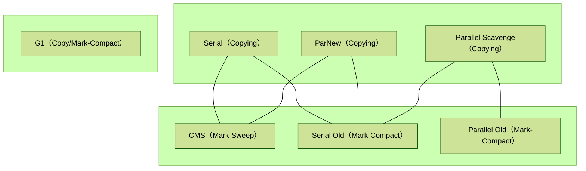

# JVM 垃圾收集器

## 评价GC指标

1. `延迟（Latency）`： 也可以理解为最大停顿时间，即垃圾收集过程中一次 `STW` 的最长时间，越短越好，一定程度上可以接受频次的增大，GC 技术的主要发展方向。

2. `吞吐量（Throughput）`： 应用系统的生命周期内，由于 `GC` 线程会占用 `Mutator` 当前可用的 CPU 时钟周期，吞吐量即为 `Mutator` 有效花费的时间占系统总运行时间的百分比，例如系统运行了 100 min，GC 耗时 1 min，则系统吞吐量为 99%，吞吐量优先的收集器可以接受较长的停顿。


<center>


</center>


## `1` ParNew

并行垃圾回收器，主要用于对年轻代进行垃圾回收。使用了多线程并行的方式进行垃圾回收，能够充分利用多核CPU的性能优势，提高垃圾回收的效率。同时，ParNew也采用了`复制算法（COPYING）`，将年轻代分成两个等大小的区域，一块区域存活的对象会被复制到另外一块区域中，而不需要进行标记和清除操作。

**Command Line Switches**

```zsh
java -XX:+UseConcMarkSweepGC -XX:+UseParNewGC
```

1. `-XX:ParallelGCThreads=<desired number>`：（并行线程数）默认情况下，ParNew使用的线程数与CPU核心数相同。如果应用程序对CPU的占用较高，可以适当降低线程数，以减少垃圾回收对应用程序的影响。

2. `-XX:NewRatio（新生代与老年代的比值）`：建议将年轻代的大小设置为整个堆空间的`1/3`到`1/4`左右。

3. 对象存活率：`ParNew` 垃圾回收器采用复制算法，存活的对象会被复制到另外一个区域中。因此，对象的存活率对垃圾回收的性能有很大影响。如果对象的存活率较高，将会导致大量的复制操作，从而影响垃圾回收的效率。

## `2` CMS (Concurrent Mark and Sweep)

采用 “`标记-清除（Mark and sweep）`” 算法，主要针对`老年代`的垃圾回收，GC 过程可以和应用程序同时运行，减少了应用程序的停顿时间，从而提高了应用程序的响应性能。但是，由于 `CMS` 需要和应用程序共享 `CPU` 和 内存资源，某些情况下会对应用程序的性能产生影响（并发收集、低停顿）

**Command Line Switches**

```zsh
java -XX:+UseConcMarkSweepGC -XX:+UseConcMarkSweepGC
```

### `2.1` GC 过程

1. `初始标记（老生代使用比率超过某值）`：停止应用程序的执行，适用 `STW` 机制标记所有的根对象，记录需要回收的对象
2. `并发标记`：初始标记之后，CMS 和应用程序同时运行，标记所有需要回收的对象。在该阶段，由于应用程序可能会不断创建新的对象，因此 CMS 需要动态地跟踪需要回收的对象
3. `重新标记`：并发标记阶段结束后， CMS 再次停止应用程序的执行，使用 `STW` 重新标记被修改的对象，由于此次标记范围比较小，因此速度比较快
4. `并发清除`：和应用程序同时运行，清楚需要回收的对象

### `2.2` Full GC

`Old Gen`：java.lang.outOfMemoryError：java heap space；

`MetaSpace`：java.lang.outOfMemoryError：MetaSapce space；

`Promotion failed`：当进行 `Young GC` 时，有部分新生代代对象仍然可用，但是S0或S1放不下，因此需要放到老年代，但此时老年代空间无法容纳这些对象）

`Concurrent mode failure`：当 `CMS GC` 正进行时，此时有新的对象要进行老年代，但是老年代空间不足造成的

统计得到的 `Minor GC` 晋升到 `Old Gen` 的平均大小大于 `Old Gen`的剩余空间

- `System.gc()`、`jmap`


### `2.3` 存在问题

- 对CPU资源非常敏感
- 无法处理浮动垃圾(`Floating Garbage`), 浮动垃圾指的是一些对象当前可能是存在引用的, 而在并发标记
    的过程中失去了引用, 但是该对象在垃圾回收器看来仍然是存活的, 即本次垃圾回收不会回收这些对象, 只
    能等下一次垃圾回收了, 可能出现 `Concurrent Mode Failure` （判定为老年代空间不足）而导致另一
    次 `Full GC` 的产生
