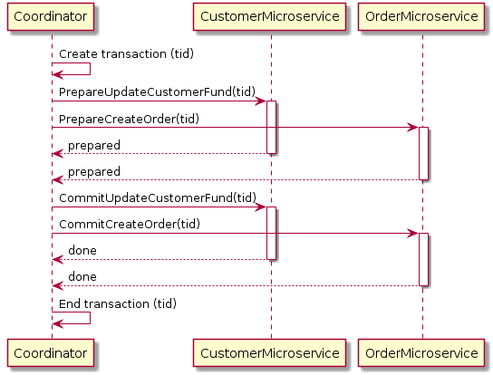

术语：

TM：Transacion Manager（事务管理器），也称为 Coodinator

RM：Resource Manager（资源管理器Cohort），例如订单系统、支付系统等

## `1` 2PC - Two-Phase Commit

{== 只有 TM 有超时 ==}，Work Flow 如下

### 第一阶段：pre-commit

TM 发送提交请求给所有相关的 RM，RMs 开启事务但不会提交，事务开启后所有资源加锁

### 第二阶段：do-commit

- 所有 RM 在预提交阶段成功，TM 向 RMs 发送 commit 消息，提交事务

- 存在一个或者多个 RM 在预提交阶段执行失败（网络异常、TM 超时等），TM 向 RMs 发送 abort 消息，回滚事务

Images From [Patterns for distributed transactions within a microservices architecture](https://developers.redhat.com/blog/2018/10/01/patterns-for-distributed-transactions-within-a-microservices-architecture)

#### PROS

相比于服务间的直接调用，2PC 能保证更高的提交成功率，在 TM 发送 commit 消息前，第一阶段 pre-commit 已经保证 RM 能正常提交，各个服务大概率处于较好的状态

#### CONS

1. 单点故障：整个流程由TM管理，如果 TM 发生异常，分布式事务会被破坏
2. 同步阻塞：在第二阶段期间，参与者在事务未提交之前会一直锁定其占有的本地资源对象，直到接收到来自TM的 doCommit 或 doAbort 消息
3. 数据不一致：第二阶段中，TM 发送 doCommit 消息给 RM1 并且 RM1 成功提交，在 RM2 接收到 doCommit 消息前 TM 和 RM1 服务异常，此时 RM1 提交但是 RM2 未提交，出现数据不一致的问题

## `2` 3PC - Three-Phase Commit

### 第一阶段：can-commit

TM 发送 CanCommit 请求消息，询问各个参与者节点，参与者节点各自评估本地事务是否可以执行并回复消息（可以执行则回复 YES，否则回复 NO），此阶段不执行事务，只做判断

### 第二阶段：pre-commit

TM 根据上一阶段收集的反馈决定通知各个参与者节点执行（但不提交）或中止本地事务；有两种可能：1) 所有回复都是 YES，则发送 PreCommit 请求消息，要求所有参与者执行事务并追加记录到 undo 和 redo 日志，如果事务执行成功则参与者回复 ACK 响应消息，并等待下一阶段的指令；2) 反馈消息中只要有一个 NO，或者等待超时之后 TM 都没有收到参与者的回复，那么TM会中止事务，发送 Abort 请求消息给所有参与者，参与者收到该请求后中止本地事务，或者参与者超时等待仍未收到 TM 的消息，同样也中止当前本地事务。

### 第三阶段：do-commit

TM根据上一阶段收集到的反馈决定通知各个参与者节点提交或回滚本地事务，分三种情况：1) TM 收到全部参与者回复的 ACK，则向所有参与者节点广播 DoCommit 请求消息，各个参与者节点收到 TM 的消息之后决定提交事务，然后释放资源对象上的锁，成功之后向TM回复 ACK，TM 接收到所有参与者的 ACK 之后，将该分布式事务标记为 committed；2) TM 没有收到全部参与者回复的 ACK（可能参与者回复的不是 ACK，也可能是消息丢失导致超时），那么 TM 就会中止事务，首先向所有参与者节点广播 Abort 请求消息，各个参与者收到该消息后利用上一阶段的 undo 日志进行事务的回滚，释放占用的资源对象，然后回复TM ACK 消息，TM收到参与者的 ACK 消息后将该分布式事务标记为 aborted；3) 参与者一直没有收到 TM 的消息，等待超时之后会直接提交事务。
