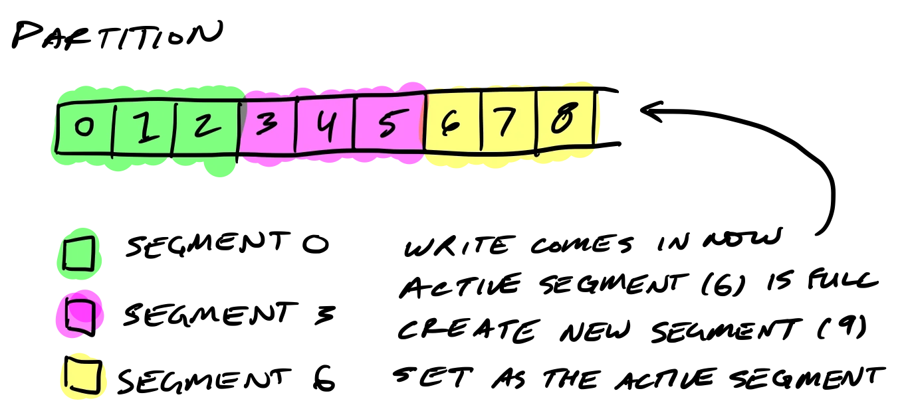
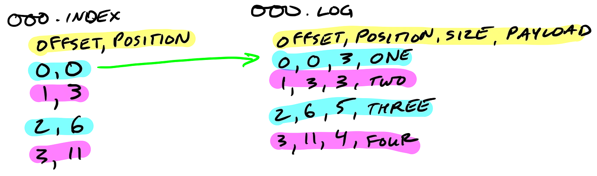

Kafka 高性能主要有以下几个方面：

- `消息批处理`：减少网络通信开销

- `顺序写盘`：减少寻道移臂开销

- `压缩`：提升数据传输效率

- `零拷贝`：减少数据多次拷贝的开销

- `分区`：提高并发

- `缓存页/异步刷盘`：减少磁盘IO开销

## 1 存储结构

Kafka是一种高效、可扩展的分布式消息系统，其存储结构主要包括以下几个部分：

### `broker`

`Kafka` 集群中的节点，用于存储和处理消息。每个Broker可以存储多个分片 `Partition` 的消息，并通过 `Zookeeper` 协调集群中的节点。在 `Kafka` 中，分片是一个独立的、不可变的消息序列，它可以独立地被操作和维护。每个分片都会在多个 `Broker` 之间进行复制，以保证数据的可靠性和容错性。

### `topic`

`Kafka` 中消息的逻辑分类，类似于数据库中的表。每个 `Topic` 包含一个或多个分片，每个分片可以分布在不同的 `Broker` 上。在 `Kafka` 中，每个分片都是一个独立的、不可变的消息序列，其存储位置可以通过分片的编号来确定。

### `partition`

`Kafka` 中消息存储的最小单位，每个 `Partition` 包含一个不可变的、有序的消息序列，每个消息都有一个唯一的偏移量。`Partition` 是 `Kafka` 支持高并发和高吞吐量的关键，它可以被水平扩展，以支持更多的客户端并发读写操作。

#### kafka + 选择合适的分区数量？


- 分区数量越多，可以实现更高的并发和更好的吞吐量，但是也需要更多的存储和处理资源
- 分区数量太少可能会限制并发和吞吐量，因为所有消息都需要在同一个分区中进行顺序处理

> `需要考虑`：

1. `预计的负载量`：如果预计每秒将向 `Kafka` 发送大量消息，则需要更多的分区以实现更好的并发性能

2. `应用程序的并发性`：应用程序需要处理多个线程或进程并发读取 `Kafka` 消息，则需要更多的分区以避免竞争条件。

3. `数据保留期`：需要保留数据的时间很长（几个月或几年），需要更多的分区以支持更大的存储需求

4. `系统资源`：根据硬件和系统资源来确定分区数量

确定Kafka的分区数量需要根据具体的场景来确定，需要平衡各个因素以实现最佳的性能和 `资源使用`


### `segment`

（分段日志）`Kafka` 中 `Partition` 的物理存储单位，每个 `Segment` 包含一个独立的、不可变的消息序列，并以磁盘文件的形式存储。当 `Segment` 达到一定大小或时间限制时，Kafka会将其关闭并创建一个新的 `Segment`。每个 `Segment` 都有一个基本的索引文件，用于支持消息的快速查找和过滤。



### `offset`

`Offset` 是 `Kafka` 中消息在 `Partition` 中的唯一标识，每个消息都有一个唯一的偏移量。在Kafka中，每个 `Partition` 都有一个独立的偏移量，用于记录最后一个被消费的消息。客户端可以通过提交偏移量来记录已经消费的消息，以便在下一次启动时继续从上次停止的位置消费。

### `index`

`Index` 是 `Kafka` 中用于支持快速消息查找和过滤的数据结构，每个 `Segment` 都有一个基本的索引文件，用于支持消息的快速查找和过滤。`Kafka` 使用了基于 `Mmap` 的文件映射技术来实现高效的索引读写操作。



通过上述存储结构的组合，`Kafka` 实现了高效、可靠的消息传递和持久化，可以在高并发、高负载的场景下快速处理消息，并保证数据的可靠性和一致性。


## 2 如何保证 Kafka 消息不丢失？

### `1` Kafka 架构

> 从三个方面分析：

- Topic 分区副本`数据一致性`
- 生产者`消息确认机制`
- 消费者`提交机制`

#### Topic 分区副本 - 副本间的消息状态一致性

> `副本间数据同步`


<center>
    <div style="color:orange; border-bottom: 1px solid #d9d9d9;
    display: inline-block;
    color: #999;
    padding: 2px;">leader 同步 follower</div>
</center>

- `Kafka` 中的每个主题分区都被复制了 `n` 次，其中的 `n` 是 `topic` 的 `replication factor`。这允许 `Kafka` 在集群服务器发生故障时自动切换到这些副本，以便在出现故障时消息仍然可用。`Kafka` 的复制是以 `partition` 为粒度的，分区的预写日志被复制到 `n` 个服务器。 在 `n` 个副本中，一个副本作为 `leader`，其他副本成为 `followers`。顾名思义，`producer` 只能往 `leader` 分区上写数据（读也只能从 `leader` 分区上进行），`followers` 只按顺序从 `leader` 上复制日志。

> `ISR in-sync replica` 同步副本列表


<center>
    <div style="color:orange; border-bottom: 1px solid #d9d9d9;
    display: inline-block;
    color: #999;
    padding: 2px;">ISR：和Leader保持同步的follower副本</div>
</center>

- 日志复制算法（`log replication algorithm`）必须提供的基本保证是，如果它告诉客户端消息已被提交，而当前 `leader` 出现故障，新选出的 `leader` 也必须具有该消息。在出现故障时，`Kafka` 会从挂掉 `leader` 的 `ISR` 里面选择一个 `follower` 作为这个分区新的 `leader` ；换句话说，是因为这个 `follower` 是跟上 `leader` 写进度的。

- 每个分区的 leader 会维护一个 `in-sync replica`（同步副本列表，又称 ISR）。当 `producer` 往 `broker` 发送消息，消息先写入到对应 `leader` 分区上，然后复制到这个分区的所有副本中。只有将消息成功复制到所有同步副本（`ISR`）后，这条消息才算被提交。由于消息复制延迟受到最慢同步副本的限制，因此快速检测慢副本并将其从 `ISR` 中删除非常重要。

!!! note 判断是否将follower从ISR移除

 ```markdown
 - leader 允许 ISR 落后的消息数：replica.lag.max.messages （已废弃）
 - follower 在不超过 replica.lag.time.max.ms 时间内向 leader 发送 fetch 请求
 - 不同步的 follower 会从 ISR 中移除
 ```

> `High Water` 机制，选择 `ISR` 中偏移量最小的分区


<center>
    <div style="color:orange; border-bottom: 1px solid #d9d9d9;
    display: inline-block;
    color: #999;
    padding: 2px;">HW</div>
</center>

**Q：如何保证分区间数据一致性？**

A： `leader` **crash** 时，`Kafka` 会从 `ISR` 根据分区选择算法选择 `follower` 作为新的`Leader`，`follower`分区拥有最新的已经 `committed` 的消息。通过这个可以保证已经 `committed` 的消息的数据可靠性
___

#### Producer 消息确认机制

> **`ack = 0`**：`Producer`通过网络把消息发出去，则认为消息已成功写入Kafka

- 序列化失败，分区离线或整个集群长时间不可用，生产者均不会收到任何错误
- 速度快，但无法保证`server`能收到消息

> **`default:ack = 1`**：`Leader`收到消息并写入分区文件时返回确认或错误响应

- 消息在写入`Leader`，`Follower`写入之前`Leader`奔溃，则消息丢失

> **`可用性保证：ack = -1`**：Leader在所有`Follower`收到消息后，才返回确认或错误响应

- `producer` 发送消息可以选择同步/异步，异步能提高消息发送的性能，但是会增加消息丢失的风险。为了确保消息可靠性，需要设置为同步：`producer.type = sync`
- 异常情况下，当同步到所有`follower`前`leader` 奔溃，`producer`会重新发送

```yaml
request.required.acks:-1 # 当leader 同步到所有follower后，才会返回响应
unclean.leader.election.enable:false # 是否允许非同步副本参与leader选举
min.insync.replicas:${N/2+2} # 用于保证当前集群中处于正常同步状态的副本数量，当实际值小于配置值时，集群停止服务
```

#### Consumer 可靠性策略

> `enable.auto.commit:true`：

- consumer 收到消息后即返回给broker，如果消费异常，则内容丢失

___
> `enable.auto.commit:false`：

- consumer 处理流程后手动提交，如果未提交时发生重启，会导致重复消费（需实现幂等）

___

> `Exactly once`：....
___

### 2 可靠性级别

> kafka 服务崩溃 / 服务器宕机

1. kafka 接收到服务消息后，先写入内存，再刷磁盘
2. kafka 对生产者返回确认后，消息存入 Kafka 服务器的 PageCache 中，并未写入磁盘
    - `log.flush.interval.messages = 1`，同步刷盘，减少消息丢失概率

```yaml
# 数据达到多少条就将消息刷到磁盘
#log.flush.interval.messages=10000
# 多久将累积的消息刷到磁盘，任何一个达到指定值就触发写入
#log.flush.interval.ms=1000
```

## 参考

- [1] [图文了解 Kafka 的副本复制机制](https://mp.weixin.qq.com/s?__biz=MzA5MTc0NTMwNQ==&mid=2650716907&idx=1&sn=3aaf4be490baf2697633b7470cf76457&chksm=887da79dbf0a2e8b31983bf37018adb0e9026c87dff5d1d43a3b4209580d71ecbe1f085be96f&scene=21#wechat_redirect)

- [2] [Kafka 是如何保证数据可靠性和一致性](https://cloud.tencent.com/developer/article/1488458)

- [3] [简单理解 Kafka 的消息可靠性策略](https://cloud.tencent.com/developer/article/1752150)
