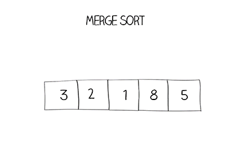

## 1 selection sort

<center>

{: style="width:600px;"}
</center>

```go title="selection_sort.go" linenums="1"
func selection_sort(arr []int) {
	n := len(arr)
	for i := 0; i < n; i++ {
		minIndex := i
		for j := i + 1; j < n; j++ {
			if arr[j] < arr[minIndex] {
				arr[j], arr[minIndex] = arr[minIndex], arr[j]
			}
		}
	}

	fmt.Printf("after selection_sort: %+v", arr)
}
```

## 2 quick sort

<center>

{: style="width:600px;"}
</center>

## 3 Merge sort - divide and conquer

<center>

{: style="width:600px;"}
</center>
