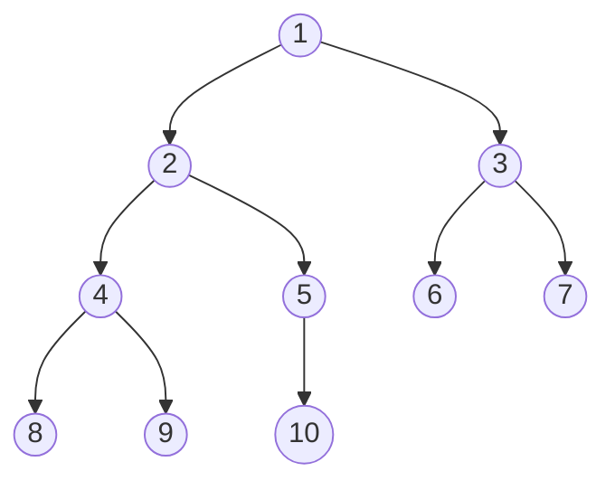
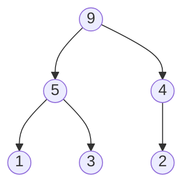
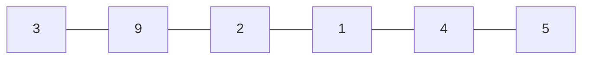
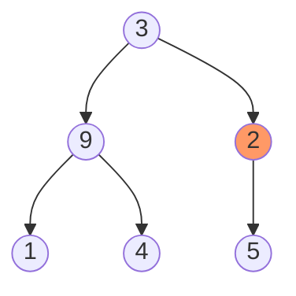

## `1` 堆的特性

堆数据结构是满足堆属性的完全二叉树，也称为二叉堆。

完全二叉树是一种特殊的二叉树，其中

- 除最后一个级别外，每个级别都已填充
- 所有节点都尽可能地向左

<center>



</center>

堆属性是其中节点的属性

- （对于最大堆）每个节点的键始终大于其子节点，并且根节点的键在所有其他节点中最大

<center>


</center>


- （对于最小堆）每个节点的键始终小于子节点，而根节点的键在所有其他节点中最小

<center>


</center>

___

## `2` 构建堆

- 输入数组：

<center>



</center>

- 从数组创建二叉树：

<center>


</center>

- 从索引为`n/2 - 1`的非叶节点的第一个索引开始。`heapify` 将当前元素i设置为 `largest`
- 左子索引由`2i + 1`给出，右子索引由`2i + 2`给出。 如果`leftChild`大于`currentElement`，则将`leftChildIndex`设置为最大。 如果`rightChild`大于`largest`中的元素，将`rightChildIndex`设置为`largest`
- 将`largest`与`currentElement`交换

<center>



</center>

- 重复 3-5，直到所有节点都被 `heapify`

```c
Heapify(array, size, i)
  set i as largest
  leftChild = 2i + 1
  rightChild = 2i + 2

  if leftChild > array[largest]
    set leftChildIndex as largest
  if rightChild > array[largest]
    set rightChildIndex as largest

  swap array[i] and array[largest]
```
```c
MaxHeap(array, size)
  loop from the first index of non-leaf node down to zero
    call heapify
```

___

## `3` 插入节点

```c
If there is no node, 
  create a newNode.
else (a node is already present)
  insert the newNode at the end (last node from left to right.)

heapify the array
```

- 在树的末尾插入新元素
- 对树建堆
___

## `4` 删除节点

```c
If nodeToBeDeleted is the leafNode
  remove the node
Else swap nodeToBeDeleted with the lastLeafNode
  remove noteToBeDeleted

heapify the array
```
___

## `5` 实现

```java title="Heap.java"
 // Max-Heap data structure in Java

import java.util.ArrayList;

class Heap {
  void heapify(ArrayList<Integer> hT, int i) {
    int size = hT.size();
    int largest = i;
    int l = 2 * i + 1;
    int r = 2 * i + 2;
    if (l < size && hT.get(l) > hT.get(largest))
      largest = l;
    if (r < size && hT.get(r) > hT.get(largest))
      largest = r;

    if (largest != i) {
      int temp = hT.get(largest);
      hT.set(largest, hT.get(i));
      hT.set(i, temp);

      heapify(hT, largest);
    }
  }

  void insert(ArrayList<Integer> hT, int newNum) {
    int size = hT.size();
    if (size == 0) {
      hT.add(newNum);
    } else {
      hT.add(newNum);
      for (int i = size / 2 - 1; i >= 0; i--) {
        heapify(hT, i);
      }
    }
  }

  void deleteNode(ArrayList<Integer> hT, int num)
  {
    int size = hT.size();
    int i;
    for (i = 0; i < size; i++)
    {
      if (num == hT.get(i))
        break;
    }

    int temp = hT.get(i);
    hT.set(i, hT.get(size-1));
    hT.set(size-1, temp);

    hT.remove(size-1);
    for (int j = size / 2 - 1; j >= 0; j--)
    {
      heapify(hT, j);
    }
  }

  void printArray(ArrayList<Integer> array, int size) {
    for (Integer i : array) {
      System.out.print(i + " ");
    }
    System.out.println();
  }

}

```