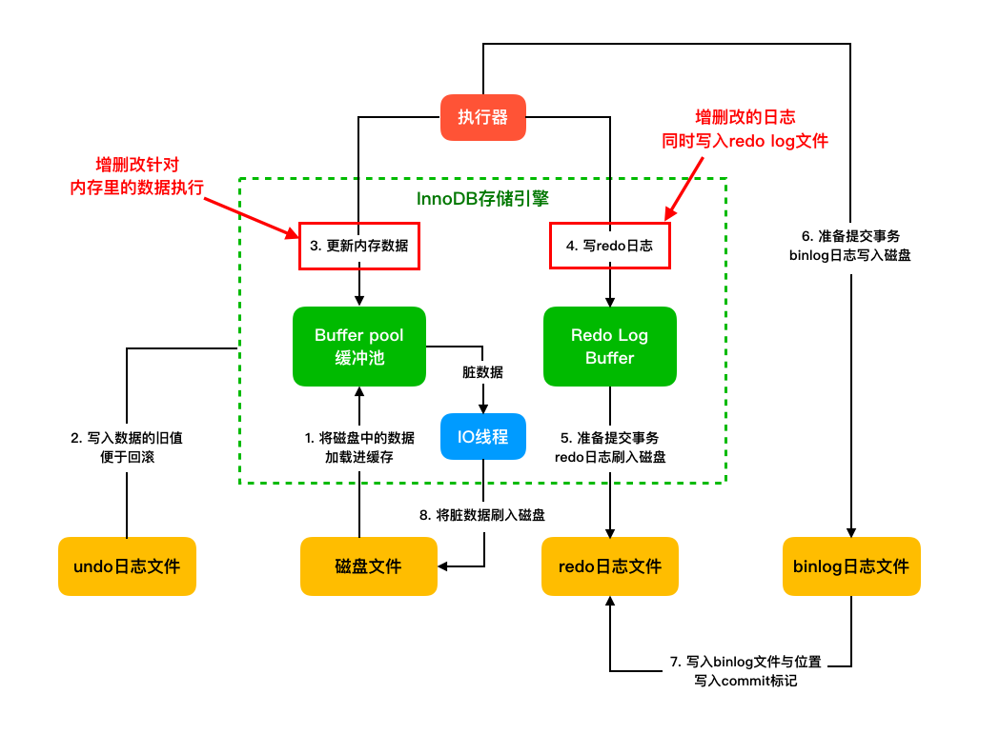
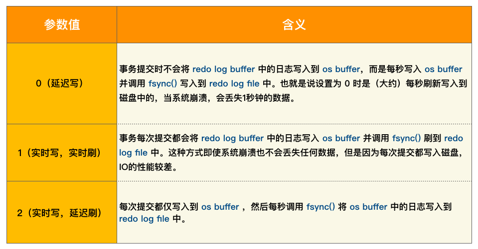
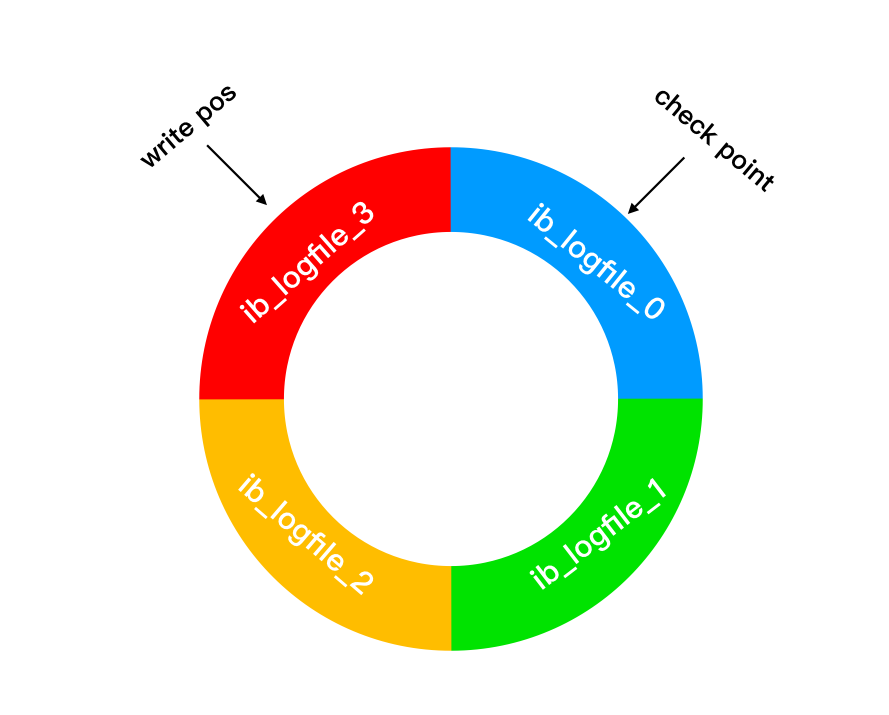

## `3-1` 参数文件

```sql
show variables; -- 查看所有参数
*************************** 1. row ***************************
Variable_name: innodb_buffer_pool_size
        Value: 134217728
1 row in set (0.01 sec)
```

=== "动态参数"
    
    ```mysql
        Set | [global | session] system_var_name=expr
  		-- 部分参数只能在 session 中修改 eg: autocommit
    	-- 部分参数在整个实例生命周期内生效 eg: binlog_cache_size
    ```

=== "静态参数"

	```markdown
    * 整个MySQL实例生命周期内都不得进行更改
    * read only
    ```

## `3-2` 日志文件

> **`常见日志类型`**
	
- 错误日志 `error log`
- 二进制日志 `binlog`
- 慢查询日志 `slow query log` 
- 查询日志 `log`

### 错误日志

记录MySQL的启动、运行、关闭过程

```sql
mysql> show variables like 'log_error'\G;
*************************** 1. row ***************************
Variable_name: log_error
        Value: ./NJXDGD02853.local.err
1 row in set (0.01 sec)
```
错误日志也会记录一些警告信息或正确的信息

``` shell
zsh > nvim ./NJXDGD02853.local.err
1 2022-01-07T01:44:52.6NZ mysqld_safe Logging to '/opt/homebrew/var/mysql/        NJXDGD02853.local.err'.                                                       
2 2022-01-07T01:44:53.6NZ mysqld_safe Starting mysqld daemon with databases       from /opt/homebrew/var/mysql                                                  
3 2022-01-07T01:44:53.842230Z 0 [System] [MY-010116] [Server] /opt/homebrew/      opt/mysql/bin/mysqld (mysqld 8.0.27) starting as process 1290                 
4 2022-01-07T01:44:53.874722Z 0 [Warning] [MY-010159] [Server] Setting            lower_case_table_names=2 because file system for /opt/homebrew/var/mysql/       is case insensitive
5 2022-01-07T01:44:54.021718Z 1 [System] [MY-013576] [InnoDB] InnoDB              initialization has started.                                                   6 2022-01-07T01:44:58.982095Z 1 [System] [MY-013577] [InnoDB] InnoDB              initialization has ended.

```

### 慢查询日志

设置 **`slow_query_log = on`**, MySQL会记录运行时间 > **`long_query_time`**的所有sql语句到**`slow-query_log_file`**日志文件中。

`>5.1` 可以查询 慢查询表 `mysql.slow_log`

```sql
mysql> show create table mysql.slow_log\G;
*************************** 1. row ***************************
       Table: slow_log
Create Table: CREATE TABLE `slow_log` (
  `start_time` timestamp(6) NOT NULL DEFAULT CURRENT_TIMESTAMP(6) ON UPDATE CURRENT_TIMESTAMP(6),
  `user_host` mediumtext NOT NULL,
  `query_time` time(6) NOT NULL,
  `lock_time` time(6) NOT NULL,
  `rows_sent` int NOT NULL,
  `rows_examined` int NOT NULL,
  `db` varchar(512) NOT NULL,
  `last_insert_id` int NOT NULL,
  `insert_id` int NOT NULL,
  `server_id` int unsigned NOT NULL,
  `sql_text` mediumblob NOT NULL,
  `thread_id` bigint unsigned NOT NULL
) ENGINE=CSV DEFAULT CHARSET=utf8mb3 COMMENT='Slow log'
1 row in set (0.05 sec)

-- 设置慢查询输出格式 `log_output=TABLE`

mysql> set global log_output='TABLE';
Query OK, 0 rows affected (0.00 sec)

select * from slow_log;
...
```

### 查询日志

记录所有对Mysql数据库请求的信息

```sql
mysql> show variables like 'general%'\G;
*************************** 1. row ***************************
Variable_name: general_log
        Value: OFF
*************************** 2. row ***************************
Variable_name: general_log_file
        Value: /opt/homebrew/var/mysql/NJXDGD02853.log
2 rows in set (0.00 sec)

mysql> set global general_log=ON;
Query OK, 0 rows affected (0.03 sec)
```

``` shell
zsh > nvim NJXDGD02853.log
1 /opt/homebrew/opt/mysql/bin/mysqld, Version: 8.0.29 (Homebrew). started         with:
2 Tcp port: 3306  Unix socket: /tmp/mysql.sock
3 Time                 Id Command    Argument
```

### 二进制日志

!!! abstract

    * Mysql server 的功能，是记录所有数据库表结构变更以及表数据修改的binary log
	* 不会记录SELECT和SHOW这类操作
	* 以事件形式记录，还包含语句所执行的消耗时间。


> **`使用场景`**

- 主从复制：在主库中开启Binlog功能，从库通过Binlog实现数据恢复达到主从数据一致性
- 数据恢复：通过mysqlbinlog工具来恢复数据

> **`文件记录模式`**

=== "ROW"

    * 记录每一行数据被修改的情况
		* 优点：完全实现主从数据同步和数据的恢复
		* 缺点：批量操作会产生大量日志，alter table会让日志暴涨

=== "STATEMENT"

    * 被修改数据的SQL都会记录到master的Binlog中，slave会解析执行binglog中的sql语句，简称SQL语句复制。
        * 优点：日志量小，减少磁盘IO，提升存储和恢复速度
        * 缺点：在某些情况下会导致主从数据不一致，比如last_insert_id()、now()等函数

=== "MIXED"

    * 以上两种模式的混合使用，一般使用 STATEMENT 模式保存binlog
	* 对于STATEMENT模式无法复制的操作使用 ROW 模式保存binlog，MySQL会根据执行的SQL语句选择写入模式。

> **`写入机制`**

:	常用的`log event`有：`Query event`、`Row event`、`Xid event`等。binlog文件的内容就是各种Log event的集合
        (1) 根据记录模式和操作触发`event事件`生成`log event`
        (2) 将事务执行过程中产生log event写入缓冲区，每个事务线程都有一个缓冲区
        (3) 事务在提交阶段会将产生的log event写入到外部binlog文件中

> **`和 redo log 区别`**

: 	- `Redo Log`属于物理日志，记录该数据页更新状态内容，`Binlog`是逻辑日志，记录更新过程
    - `Redo Log`日志是循环写，日志空间大小是固定，`Binlog`是追加写入
    - `Redo Log`作为服务器异常宕机后事务数据自动恢复使用，`Binlog`可以作为主从复制和数据恢复使用

## `3-3` 存储引擎文件

### 表空间文件

- 存储的数据按表空间 `tablespace` 进行存放
- 默认的表空间文件 **ibdata1**

```shell
+-----------------------+------------------------+
| Variable_name         | Value                  |
+-----------------------+------------------------+
| innodb_data_file_path | ibdata1:12M:autoextend |
+-----------------------+------------------------+
mysql> show variables like 'innodb_file_per_table'\G;
*************************** 1. row ***************************
Variable_name: innodb_file_per_table
        Value: ON
1 row in set (0.01 sec)
```

- 所有表的数据会存在 `innodb_data_file_path` 共享表空间中

- IF **`innodb_file_per_table`** = ON 则每个表会产生一个独立表空间

### redo log

- {== 定义 ==}：位于存储引擎层的物理日志，用来记录在`数据页做了什么修改`的物理日志文件

- {== 存在的必要性 ==}：记录数据被修改后的样子，提供数据恢复的能力

- {== `WAL` Write-Ahead Logging ==}：在同步磁盘前先写日志，然后系统再根据一定的策略将日志里的记录同步到磁盘里


- {== 写入时机 ==}：每执行一条语句，会先将记录写入 `redo log buffer`，后续执行 `commit` 操作时会以一定的时机写入到 `redo log` 文件`磁盘中`（ `innodb_flush_log_at_trx_commit`）



- {== 写入方式 ==}: 循环写入

: `write pos` 表示当前记录的位置，随着不断写入逐渐后移。当写到 `ib_logfile_3`时，整个 `redo log` 就被写满了。
  此时更新操作就会被阻塞。系统根据 `check point` 标记位来擦除一些`已同步到磁盘的记录`

{: style="width:500px;"}

### undo log

- 定义: 在进行数据修改时，同时记录 undo log `相反操作的逻辑日志`

- 作用: 当事务回滚时。从 undo log 中读取到对应的逻辑记录就可以进行回滚操作了。
