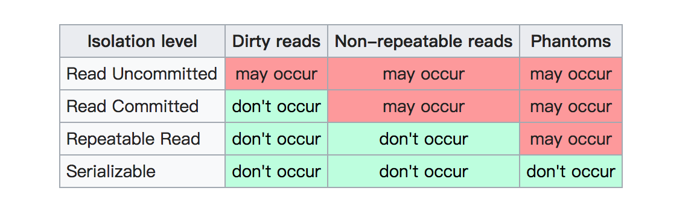
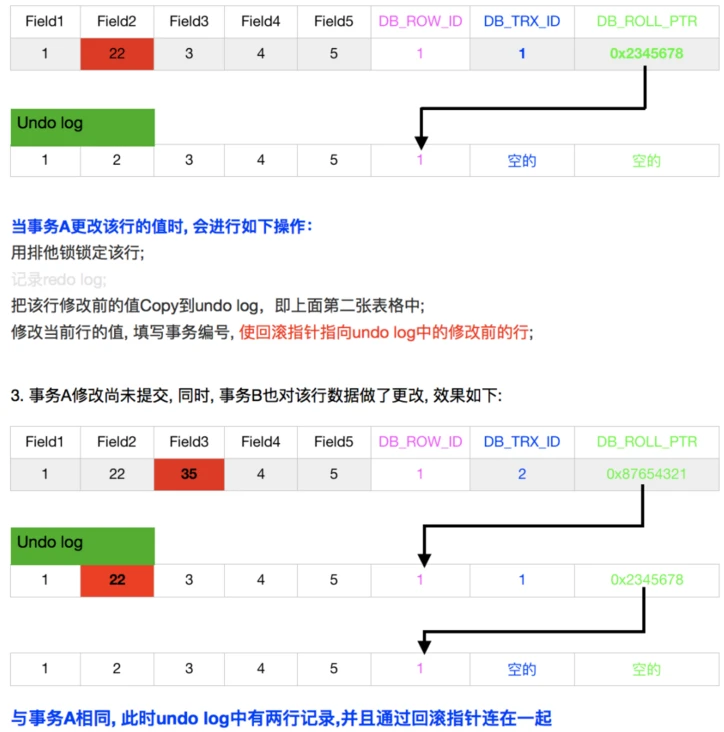

## 7-1 概念

- 事务Transaction是访问和更新数据库的程序执行单元；
- 事务中可能包含一个或多个sql语句，这些语句要么都执行，要么都不执行。
 - ACID是衡量事务的四个特性

> 提交和回滚

:	默认自动提交 autocommit=ON
	如果没有 start transaction 显式地开始一个事务，那么每个sql语句都会被当做一个事务执行提交操作。

:	autocommit=OFF 时，所有的 sql 语句都在一个事务中，直到执行了 commit/rollback，该事务结束，同时开始了另外一个事务。

: 	执行 DDL 语句 create table/drop table/alter/table、lock tables语句会强制马上执行 commit 提交事务

### Atomicity

> A 原子性

: 原子性是指一个事务是一个不可分割的工作单位，其中的操作要么都做，要么都不做；如果事务中一个sql语句执行失败，则已执行的语句也必须回滚，数据库退回到事务前的状态

> 实现原理 undo log

:	InnoDB实现回滚，靠的是 undo log：当事务对数据库进行修改时，InnoDB会生成对应的undo log；如果事务执行失败或调用了rollback，导致事务需要回滚，便可以利用undo log中的信息将数据回滚到修改之前的样子。

	undo log 属于逻辑日志，它记录的是sql执行相关的信息。当发生回滚时，InnoDB会根据undo log的内容做与之前相反的工作：对于每个insert，回滚时会执行delete；对于每个 delete，回滚时会执行 insert；对于每个update，回滚时会执行一个相反的update，把数据改回去。

### Durability

> D 持久性

: 持久性是指事务一旦提交，它对数据库的改变就应该是永久性的。接下来的其他操作或故障不应该对其有任何影响。

> 实现原理 redo log

:	当数据修改时，除了修改Buffer Pool中的数据，还会在redo log记录这次操作；当事务提交时，会调用fsync接口对redo log进行刷盘。如果MySQL宕机，重启时可以读取redo log中的数据，对数据库进行恢复。redo log采用的是WAL（Write-ahead logging，预写式日志），所有修改先写入日志，再更新到Buffer Pool，保证了数据不会因MySQL宕机而丢失，从而满足了持久性要求。

 	可见 Part 2 / 文件 / redo log

### Isolation

> I 隔离性

: 事务内部的操作与其他事务是隔离的，并发执行的各个事务之间不能互相干扰。严格的隔离性，对应了事务隔离级别中的Serializable

> 实现原理1：写操作对写操作的影响：锁机制

:	事务在修改数据之前，需要先获得相应的锁；获得锁之后，事务便可以修改数据；该事务操作期间，这部分数据是锁定的，	其他事务如果需要修改数据，需要等待当前事务提交或回滚后释放锁。

```sql
-- 查看锁
mysql > SHOW ENGINE INNODB STATUS\G;
...
------------
TRANSACTIONS
------------
Trx id counter 376699
Purge done for trx's n:o < 376699 undo n:o < 0 state: running but idle
History list length 0
LIST OF TRANSACTIONS FOR EACH SESSION:
---TRANSACTION 281479543263128, not started
0 lock struct(s), heap size 1128, 0 row lock(s)
---TRANSACTION 281479543261544, not started
0 lock struct(s), heap size 1128, 0 row lock(s)
---TRANSACTION 281479543260752, not started
0 lock struct(s), heap size 1128, 0 row lock(s)
---TRANSACTION 370303, ACTIVE (PREPARED) 1127570 sec
1 lock struct(s), heap size 1128, 0 row lock(s), undo log entries 1
```

> 实现原理2：写操作对读操作的影响：MVCC

:	见下节

### Consistency

> C 一致性

: 一致性是指事务执行结束后，数据库的完整性约束没有被破坏，事务执行的前后都是合法的数据状态。数据库的完整性约束包括但不限于：实体完整性（如行的主键存在且唯一）、列完整性（如字段的类型、大小、长度要符合要求）、外键约束、用户自定义完整性

> 实现原理

- 保证原子性、持久性和隔离性，如果这些特性无法保证，事务的一致性也无法保证
- 数据库本身提供保障，例如不允许向整形列插入字符串值、字符串长度不能超过列的限制等
- 应用层面进行保障

## 7-2 MVCC

> Innodb 实现 MVCC的方式

- 事务以X Lock排他锁的形式修改原始数据

- 把修改前的数据存放于undo log，通过回滚指针与主数据关联

- 修改失败恢复undo log中的数据rollback

!!! note

	- MVCC只在 READ COMMITTED 和 REPEATABLE READ 下工作
  	- READ UNCOMMITTED 总是读取最新的数据行, 而不是符合当前事务版本的数据行
	- SERIALIZABLE 则会对所有读取的行都加锁
	

> 事务版本号

: 每次事务开启前都会从数据库获得一个自增长的事务ID，可以从事务ID判断事务的执行先后顺序

> 表格的隐藏列

:  DB_ROLL_PTR 7 byte：指向上一个版本数据在undo log里的位置指针

:  DB_TRX_ID 6 byte：记录操作该数据事务的事务ID

:  DB_ROW_ID 6 byte：隐藏ID，当创建表没有合适的索引作为聚集索引时，会用该隐藏ID创建聚集索引;

> undo log

:	保证事务进行rollback时的原子性和一致性，当事务进行回滚的时候可以用undo log的数据进行恢复

:	用于MVCC快照读的数据，通过读取undo log的历史版本数据可以实现不同事务版本号都拥有自己独立的快照数据版本

> read view

: innodb 中每个事务开启后都会得到一个read_view。副本主要保存了当前数据库系统中正处于活跃uncommited的事务ID号，即副本中保存的是系统中当前不应该被本事务看到的其他事务id列表

> 事务对记录的更新过程


