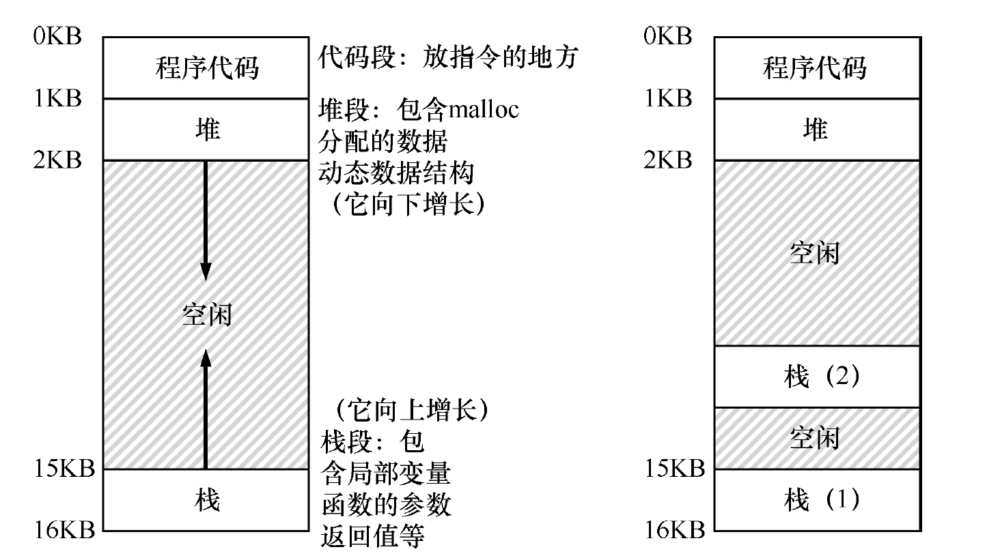

与进程相比，线程的上下文切换有一点区别：地址空间保持不变（即不需要切换当前使用的页表）



多线程的进程中，每个线程独立运行（不是地址空间只有一个栈，而是每个线程有一个栈），通常栈不会很大（除了大量使用递归的程序）

## 共享数据

```c
#include <stdio.h>
#include <pthread.h>

static volatile int counter = 1;

void *mythread(void *arg)
{
	printf("%s:begin\n", (char *)arg);
	int i;
	for (i = 0; i < 1e7; i++)
	{
		counter++;
	}
	printf("%s:done\n", (char *)arg);
	return NULL;
}

int main(int argc, char *argv[])
{
	pthread_t p1, p2;
	printf("main: begin (counter = %d)\n", counter);
	pthread_create(&p1, NULL, mythread, "A");
	pthread_create(&p2, NULL, mythread, "B");

	pthread_join(p1, NULL);
	pthread_join(p2, NULL);
	printf("main: done with both (counter = %d)\n", counter);
	return 0;
}
```

编译器为更新计数器生成的代码序列（在x86中）：

```armasm
mov 0x8049a1c, %eax
add $0x1, %eax
mov %eax, 0x8049a1c
```

变量 counter 位于地址 0x8049a1c，先用 x86 的 mov 指令，从内存地址处取出值，放入 eax。然后，给 eax 的寄存器加1（0x1）。最后，eax 的值被放回内存中相同的地址。

关键并发术语：

- 临界区（critical session）是访问共享资源的一段代码，资源通常是一个变量或数据结构
- 竞态条件（race condition）出现在多个线程大致同时进入临界区，它们都试图更新临界区共享的数据结构
- 不确定性（indeterminate）程序由一个或多个竞态条件组成，程序的输出因运行而异常，具体取决于哪些线程在何时运行，这导致结果不是确定的（deterministic），而我们通常期望计算机系统输出确认的结果
- 为了避免这些问题，线程应该采用互斥（mutual exclusion）原语。从而保证只有一个线程进入临界区，避免出现竞态，输出确认的结果。