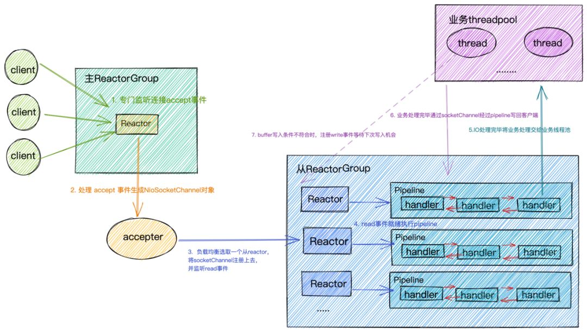
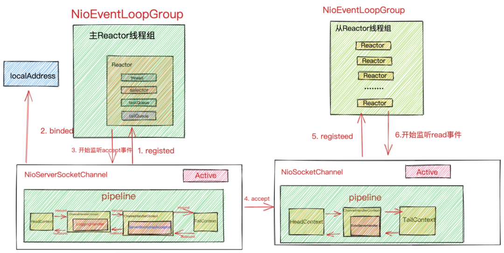
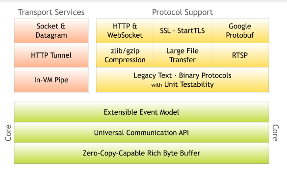
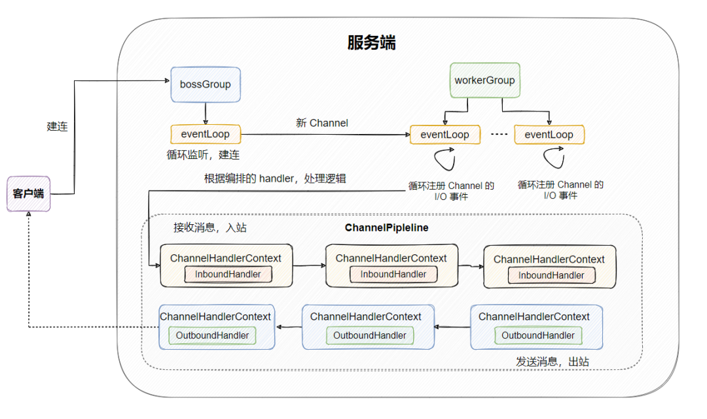

# Netty

## `1` Intro

Netty 是一个用于高效开发网络应用的 NIO 网络框架：

- `I/O` 模型、线程模型和事件处理机制
- 易用性 API 接口
- 对数据协议、序列化的支持

> 高性能，低延迟

`I/O` 请求分为两个阶段：

- **调用阶段**：用户进程向内核发起系统调用
- **执行阶段**：内核等待 `I/O`请求处理完成返回，首先等待数据就绪，并写入内核缓冲区；随后将内核缓冲区数据拷贝至用户态缓冲区

### `1.1` Linux `I/O` 模式

`1`. 同步阻塞 `I/O` - BIO
`2`. 同步非阻塞 `I/O` - NIO
	- 应用进行发起`I/O`请求后不同步等待结果，通过轮询的方式获取结果
	- NIO 相比 BIO大幅提升了性能，但轮询过程中大量的系统调用会导致上下文切换开销很大
`3`. `I/O` 多路复用
	- 实现了一个线程处理多个 `I/O` 句柄的操作
	- 多路：多个数据通道
	- 复用：使用一个或多个固定线程来处理每一个 Socket
`4`. 信号驱动 `I/O`
	- 数据准备就绪后，内核通过发送 `SIGIO` 信号通知应用进程，应用进程便可以开始读取数据
`5`. 异步 `I/O`
	- 内核缓冲区拷贝数据到用户态缓冲区的过程由系统异步完成，应用进程只需在指定数组中引用数据即可

### `1.2` Netty `I/O` 模型

`Netty` 的 `I/O` 模型基于非阻塞 `I/O` 实现，依赖的是 `JDK NIO` 框架的多路复用器 `Selector`，一个多路复用器可以同时轮询多个 `channel`，采用 `epoll` 模式后，只需要一个线程负责 `Selector` 轮询，就可以接入成千上万的客户端

    
Netty I/O 模型

___

    
Netty 线程模型

### `1.3` 网络框架选型

`Netty` 和 `Tomcat` 最大的区别在于对通信协议的支持，`Tomcat` 可以说是一个 `Http Server`，主要解决 `Http` 协议层的传输，而 `Netty` 不仅支持 `Http` 协议，还支持 `SSH`、`TLS/SSL` 等多种应用层协议，而且能够自定义应用层协议。

`Tomcat` 需要遵循 `Servlet` 规范，`Tomcat 6.x` 之后已经支持 `NIO``，性能得到较大提升。Netty` 和 `Tomcat` 侧重点不同，没有 `Servlet` 规范的约束，可以最大化发挥 `NIO` 特性。如果仅仅需要 HTTP 服务器，推荐使用 Tomcat，如果面向 `TCP` `的网络应用开发，Netty` 是最佳选择。

## `2` 整体结构

    
代码分层

### `2.1` Core

### `2.2` Protocol Support

### `2.3` Transport Service

    
Netty 整体架构

