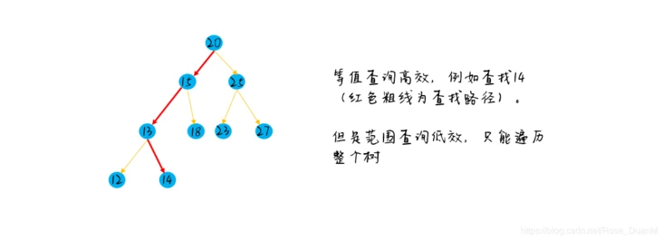
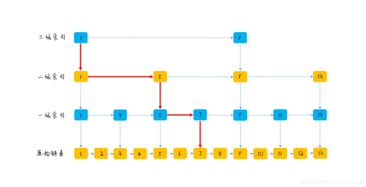
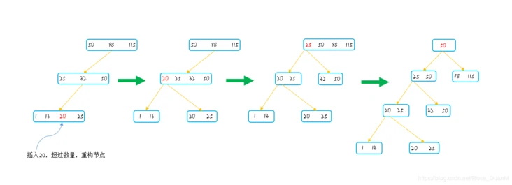

# 5 - 索引

## **`preview`**

> 索引是帮助数据库高效获取数据的数据结构

## `5-1` **`分类`**

=== "按存储结构划分"

    ``` markdown
        1.bptree 
		2.哈希索引 `self-tuning` 不能人为干预在一张表中生成哈希索引
		3.full-index全文索引
		4.rtree
    ```

=== "按应用层次划分"

    ``` markdown
        1.普通索引 `一个索引只包含单个列`
		2.唯一索引 `索引列的值唯一/NULL`
		3.复合索引 `一个索引包含多个列`
    ```

=== "从表记录的排列顺序和索引的排列顺序是否一致来划分"

    ``` markdown
        1.聚集索引 `主键索引` `叶子节点存储的是表中的数据` `排列一致`
    	2.非聚集索引 `辅助索引` `叶子节点存储的是主键和索引列` `排列不一致` 
    ```

!!! note "非聚集索引"

 	索引的逻辑顺序与磁盘上行的物理存储顺序不同，非聚集索引在叶子节点存储的是主键和索引列
	使用非聚集索引查询数据时，需要拿到叶子上的主键再去表中查到想要查找的数据 [回表]

## `5-2` **`索引的添加/删除`**

> **`CREATE INDEX`**

```sql
mysql> CREATE TABLE t1 (col1 INT, col2 INT, INDEX func_index ((ABS(col1))));
mysql> CREATE INDEX idx1 ON t1 ((col1 + col2));
mysql> CREATE INDEX idx2 ON t1 ((col1 + col2), (col1 - col2), col1);
mysql> ALTER TABLE t1 ADD INDEX ((col1 * 40) DESC);
mysql> show index from t1;
+-------+------------+------------------+--------------+-------------+-----------+-------------+----------+--------+------+------------+---------+---------------+---------+-------------------+
| Table | Non_unique | Key_name         | Seq_in_index | Column_name | Collation | Cardinality | Sub_part | Packed | Null | Index_type | Comment | Index_comment | Visible | Expression        |
+-------+------------+------------------+--------------+-------------+-----------+-------------+----------+--------+------+------------+---------+---------------+---------+-------------------+
| t1    |          1 | func_index       |            1 | NULL        | A         |           0 |     NULL |   NULL | YES  | BTREE      |         |               | YES     | abs(`col1`)       |
| t1    |          1 | idx1             |            1 | NULL        | A         |           0 |     NULL |   NULL | YES  | BTREE      |         |               | YES     | (`col1` + `col2`) |
| t1    |          1 | idx2             |            1 | NULL        | A         |           0 |     NULL |   NULL | YES  | BTREE      |         |               | YES     | (`col1` + `col2`) |
| t1    |          1 | idx2             |            2 | NULL        | A         |           0 |     NULL |   NULL | YES  | BTREE      |         |               | YES     | (`col1` - `col2`) |
| t1    |          1 | idx2             |            3 | col1        | A         |           0 |     NULL |   NULL | YES  | BTREE      |         |               | YES     | NULL              |
| t1    |          1 | functional_index |            1 | NULL        | D         |           0 |     NULL |   NULL | YES  | BTREE      |         |               | YES     | (`col1` * 40)     |
+-------+------------+------------------+--------------+-------------+-----------+-------------+----------+--------+------+------------+---------+---------------+---------+-------------------+
6 rows in set (0.01 sec)

mysql> explain select * from t1 where col1+col2 > 1;
+----+-------------+-------+------------+-------+---------------+------+---------+------+------+----------+-------------+
| id | select_type | table | partitions | type  | possible_keys | key  | key_len | ref  | rows | filtered | Extra       |
+----+-------------+-------+------------+-------+---------------+------+---------+------+------+----------+-------------+
|  1 | SIMPLE      | t1    | NULL       | range | idx1          | idx1 | 9       | NULL |    1 |   100.00 | Using where |
+----+-------------+-------+------------+-------+---------------+------+---------+------+------+----------+-------------+
1 row in set, 1 warning (0.00 sec)

-- 删除索引
mysql> alter table t1 drop index idx1;
Query OK, 0 rows affected (0.02 sec)
Records: 0  Duplicates: 0  Warnings: 0
```
> **`Cardinality`**

: Innodb通过`随机采样`估计索引中不重复记录，如果这个相对值很小，可能就要评估索引是否有意义[`高选择性`]

!!! note

	```md
 	对于innodb来说，达到以下2点就会重新计算cardinality
	- 表中`1/16`的数据发生变化
	- 如果stat_modified_counter > 200 000 0000
	```

> 覆盖索引 `covering index`

: `不需要回表`：从`辅助索引`中即可得到查询的记录，不需要查询`聚集索引`

> 优化器选择不使用索引的情况

> Multi-Range Read

: 减少磁盘随机访问，并且将随机访问转化为较为顺序的数据访问	

> Index Condition Pushdown

: 取出索引的同时，根据`WHERE`过滤记录，即将`WHERE`的部分放在存储引擎层


## `5-3` **`bptree`**

```sql
-- 等值查询
select * from T where id = 1; 
-- 范围查询
select * from T where id > 10 and id < 20; 
```

> **`Hash table`**


- `等值查询` 非常高效

- `范围查询` 排列是无序的，不支持范围查询

> **`AVL/红黑树`**



- `等值查询` `O(logn)` 

- `范围查询` 对于树结构来说，范围查询只能中序遍历一棵树得到一个有序的数据集，然后再依次查找

> **`跳表`**



- `等值查询` `OK`

- `范围查询` `OK`

> **`btree` 优化的平衡二叉查找树 **


- `bptree` 叶子结点用链表相连 `sorted` 支持 `等值查询`和`范围查询` 并且 `O(n) = log(n)`，数据存储在`磁盘上`

- `缺点`：访问每一层节点代表一次IO 查询速度慢

> **`bptree` B+树** 


: 相比于`优化的平衡二叉查找树` 每一层节点存储的数据多，树的高度更低低，访问磁盘的次数变少了，查询性能 `得到了提升`

> **`bptree的缺点`**



:	当不断`插入/删除`数据的时候，为了维护查询的效率，不产生多余的 `IO 操作`，需要对节点进行`分裂重组`。


