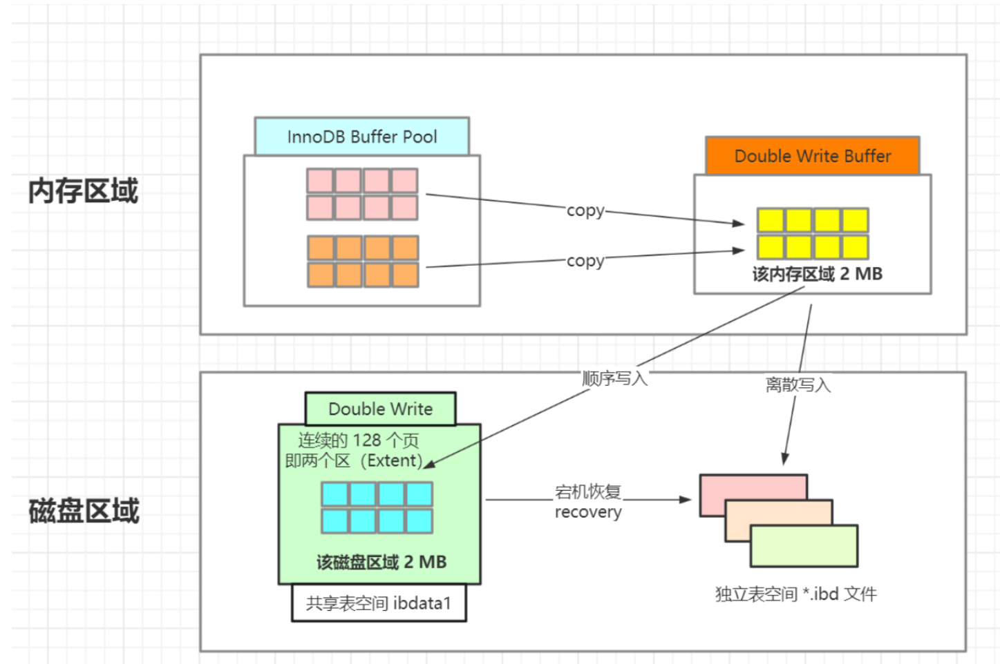

# 2 - 体系结构

## `2.1` 缓冲池 Buffer pool

<center><code>Table 1.1 Innodb架构</code></center>


!!! abstract

    缓冲池：内存中的一块区域，通过缓存表数据和索引数据，把磁盘上的数据加载到缓冲池，避免每次访问都进行磁盘IO，加速访问（把“最热”的数据放到“最近”的地方，以“最大限度”降低磁盘访问）

> `预读`

:   操作系统的磁盘读写为按页读取，`一次至少读一页数据`（一般是4K），如果未来要读取的数据就在页中，就能够省去后续的磁盘IO，提高效率

    数据访问通常都遵循“集中读写”的原则，使用一些数据，大概率会使用附近的数据，即“局部性原理”，提前加载能减少磁盘IO

> `缓冲池 LRU（Least Rrecently Used）算法`

{: style="width:300px;"}

LRU分为两部分:

- New Sublist `New 链表` 热点数据
- Old Sublist `Old 链表`

:   频繁使用的页在`New 链表`的前端，最少使用的页在Old链表的尾端。当缓冲池无法存放新读取到的页时，首先释放`Old链表`末端的页；

:   缓冲池中页的大小默认为`16KB` 
    OS中页的大小默认为`4KB` 

:   `New Sublist` 和 `Old Sublist` 首尾相连

!!! example

    ``` markdown
    * New 链表为LRU链表长度 `innodb_old_blocks_pct = 5/8`  
    * 新页加入到缓冲池是`预读/查询`会被放到LRU链表的Midpoint位置 `New 链表的尾端`
    * 缓冲池被访问的页需要等待 T=`innodb_old_blocks_time` 才会从Midpoint加入New 链表首端
    * 没有被访问的页会比New 链表中的热点数据更早淘汰出缓冲池
    ```

!!! summary

    ``` markdown
    1、缓冲池（Buffer Pool）是一种常见的降低磁盘访问的机制；
    3、Page可以分为Free Page（空闲页）、Clean Page（干净页）、Dirty Page（脏页）；
    3、缓冲池中含有3个链表：LRU链表（LRU List）、Free链表（Free List）、Flush链表（Flush List）;
    ```
___

## `2.2` 检查点 Checkpoint

> **`解决问题：`**

:   - 缩短db恢复时间
    - 缓冲池不够用时讲脏页刷新到磁盘
    - redo log不可用时，刷新脏页

> **`检查点分类`**

=== "Sharp checkpoint"

    ``` markdown
        将所有脏页写到磁盘上
        发生在数据库正常关闭时
        `innodb_fast_shutdown=1`
    ```

=== "Fuzzy checkpoint"

    ``` markdown
        将部分脏页写到磁盘上
        发生在数据库正常运行时
       - Master thread checkpoint
       - FLUSH_LRU_LIST checkpoint
       - Async/sync flush checkpoint
       - Dirty page too much checkpoint
    ```
    
> **`Fuzzy checkpoint`**

- `Master thread checkpoint`

:      异步缓冲池的脏页列表中刷新一定比例的页到磁盘中

- `FLUSH_LRU_LIST checkpoint`

:      LRU链表可用空闲页 < ? 时，innodb会将LRU列表尾端的innodb_lru_scan_depth个页移除，如果这些页中有脏页，那么需要进行checkpoint

- `Async/sync flush checkpoint`

:      当redo log不可用时，将脏页从脏页列表中刷回磁盘

- `Dirty page too much checkpoint`

:      脏页的数量太多 `> Innodb_buffer_pool_pages`，导致强制进行Checkpoint

___

## `2.3` Master Thread

Innodb中的 `Master Thread` 是后台运行的线程，大多数任务都是I/O相关的，包括：

- 将日志缓冲刷新到磁盘[`redo log...`]，即使事务还未提交
- 合并 insert buffer
- 最多刷新100个缓冲池中的脏页到磁盘
- ...

___

## `2.4` Innodb关键特性

### `4.1` Change Buffer


> **`结构`**

:   `物理页 bptree`

> **`使用条件`**

:   non-unique secondary indexes 非唯一辅助索引

    - primary key 和 clustered indexes 按顺序插入，非随机IO
    
    - 写唯一索引需要判断索引是否存在，将修改记录相关的索引页读出来（读操作）

> **`WHY`**

:   非唯一辅助索引的修改操作并非实时更新索引的叶子页，而是把若干对同一页面的更新缓存起来做，合并为一次性更新操作，减少IO同时`随机 IO` => `顺序 IO`，避免随机IO带来性能损耗，提高数据库的写性能

> **`HOW IT WORKS`**

:   判断更新的页是否在缓冲池中

    - `Yes`: 直接 update
    - `No`: 存入 change buffer，合并非唯一索引和索引页的页子节点

### `4.2` `两次写` doublewrite



> **`HOW IT WORKS`**

:   `doublewrite` 在磁盘上有一块专门的存储区域，InnoDB 刷脏页到磁盘时，先将页面写到存储区，然后再将页面写入到InnoDB数据文件中。`doublewrite`加重了磁盘IO的负载，但是能够保证异常场景下的数据完整性。

!!! note "doublewrite 保证数据完整性"

    InnoDB 页面默认大小16KB，操作系统一次写入的块大小默认为4KB，传统的磁盘块大小为512字节，因此MySQL的一个页面要写入到磁盘，需要分批进行写入，分批写入不是原子操作，在写入的过程中，如果发生异常，那么一个16KB的页面，就有可能只有部分数据成功写入到了磁盘，导致页面数据被写乱（页损坏）。InnoDB崩溃恢复时，发现页损坏，就能从doublewrite存储区拿到完整的页面，顺利执行崩溃恢复过程。

### `4.3` 自适应哈希索引 Adaptive hash indexing (AHI)

> `innodb_adaptive_hash_index`

> **`HOW IT WORKS`**

:   - 索引 `bptree` 增多
    - `bptree` 逐层定位，检索数据页时间成本上升
    - 建立缓存`AHI` 根据检索条件，直接查询对应的数据页
  
> **使用条件**

:   - 某个 `bptree` 要被使用足够多次
    - 该 `bptree` 上的检索条件要被经常使用
    - 该 `bptree` 上的某个数据页要被经常使用


### `4.4` 异步 IO

> **`innodb_use_native_aio`**

### `4.5` 刷新临接页 Flush Neighbor Page

> **`inodb_flush_neighbors`**

> **`HOW IT WORKS`**

:   刷新一个脏页时，Innodb会检测该页所在区`extent`的所有页，如果是脏页，则一起刷新。