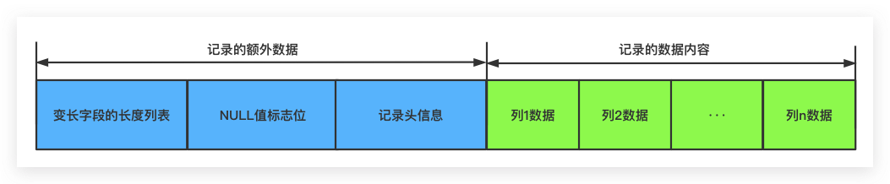
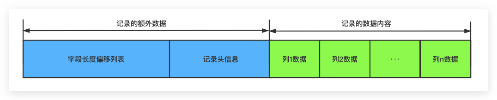

# 4 - 表

## `4.1` **`索引组织表`**

> `表按主键顺序组织存放`

如果创建表时没有显示指定主键，则：

    1 判断表中是否有 unique NOT NULL 索引，有则以该列`第一个定义`为主键

    2 否则，自动创建一个6字节大小的指针

!!! note

	_rowid可以显示表的主键
___

## `4.2` **`逻辑存储结构`**

> `innodb逻辑存储结构`


> **`表空间` tablespace**
  
> **`段`segment**

: - 数据段 `bptree的叶子结点`
 - 索引段 `bptree的非页节点`
 - 回滚段

> **`区`extent**

: 连续页组成的空间 大小为`1MB`
  为了保证区中页的连续性，Innodb一次从磁盘申请`4～5`个区
  默认情况下 Innodb页的大小为`16KB` 一个区中一共有64个连续的页

> **`页`page**

: Innodb 磁盘管理的最小单位
  通过`innodb_page_size`设置页的大小（不可再次修改）
  ```markdown
  - data page `bptree Node`
  - undo page 
  - system page
  - transaction system page
  - insert buffer bitmap
  - insert buffer free list
  - uncompressed blob page
  - compressed blob page
  ```

> **`行`row**

:	每页最多允许存放 `16KB/2-200`= 7992的记录 

___

## `4.3` **`行记录格式`**

```shell
mysql> show variables like 'innodb_default_row_format'\G;
*************************** 1. row ***************************
Variable_name: innodb_default_row_format
        Value: dynamic
1 row in set (0.01 sec)
```

> `compact`



> `redundant`



> `dynamic` and `compressed`

:	`Dynamic`、`Compressed`和`compact`行格式比较相似。
	区别在于对待处理行溢出的处理及策略，`Dynamic`、`Compressed`行格式会把记录中数据量过大的字段值
	全部存储到溢出页中，而不会在该记录的数据内容的相应字段处存储该字段值前768个字节的数据。
	`compressed`相比较`dynamic`行格式来说，前者会使用压缩算法对所有页面（包括溢出页）进行压缩以减少存储占用


## `4.4` **`数据页结构`**

> `Innodb数据页结构图`


> `用户在数据页中的真实数据`


!!! note

  `File Header`、`Page Header`、`File Trailer` 的大小是固定的，分别为 38、56、8字节。`User Records`、`Free Space`、`Page Directory` 这些部分为实际的行记录存储空间，因此大小是动态的。

## `4.5` **`约束`**

> **`数据完整性`**

```markdown
1 实体完整性保证表中有一个主键
2 域完整性保证数据每列的值满足特定的条件
3 参照完整性保证两张表的关系
```


!!! warning "约束和索引的区别"

  约束是一个逻辑的概念，用来保证数据的完整性
  索引是一个数据结构，既有逻辑的概念，在数据库中还代表着数据存储的方式


> **`Innodb 约束类型`**

- Primary key
- Unique key
- Foreign key
- Default

> **`NOT NULL`**

> **`ENUM/Set constrain`**

> **`trigger`**

: 在 `DELETE` `INSERT` `UPDATE`前后自动调用

```sql
mysql> CREATE TABLE account (acct_num INT, amount DECIMAL(10,2));
Query OK, 0 rows affected (0.03 sec)

mysql> CREATE TRIGGER ins_sum BEFORE INSERT ON account
       FOR EACH ROW SET @sum = @sum + NEW.amount;
Query OK, 0 rows affected (0.01 sec)
```

> **`Foreign key`**

:   用来保证`参照完整性`

> **`View`** 视图

: 一个命名的`虚表`，可以当表使用，但没有实际的物理存储

```sql
mysql> CREATE TABLE t (qty INT, price INT);
mysql> INSERT INTO t VALUES(3, 50);
mysql> CREATE VIEW v AS SELECT qty, price, qty*price AS value FROM t;
mysql> SELECT * FROM v;
+------+-------+-------+
| qty  | price | value |
+------+-------+-------+
|    3 |    50 |   150 |
+------+-------+-------+
```


## `4.6` **`Partition`**

: 可见 [`Mysql 分区`](../oceanbase/../../oceanbase/3%20多租户-索引-分区/03%20MySql%E5%88%86%E5%8C%BA.md)