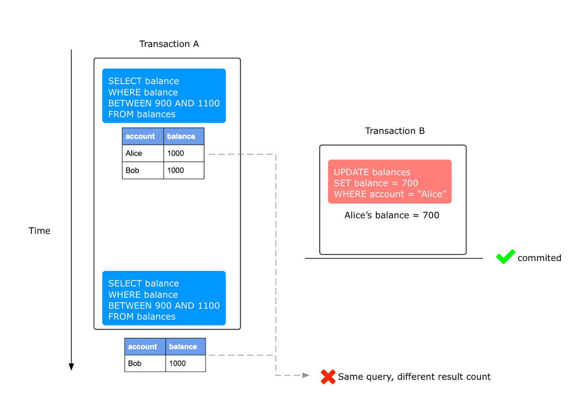
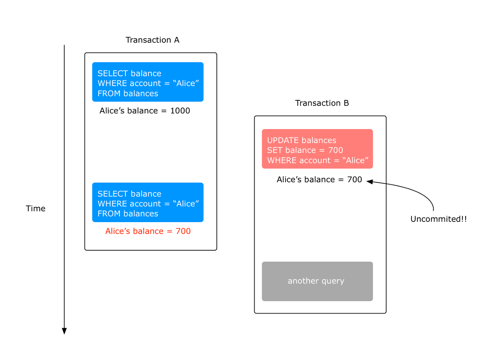
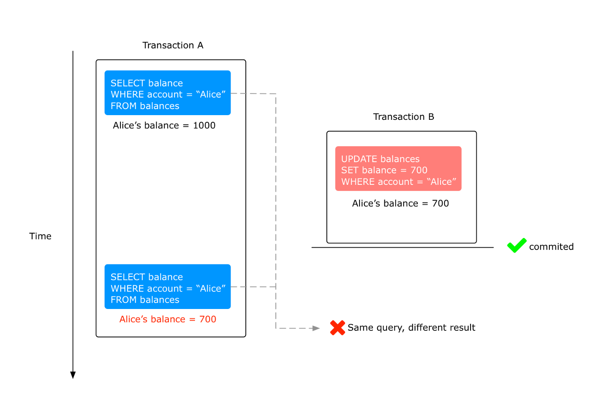

# 6 - 锁

## `6-1` **`Innodb 存储引擎中的锁`**

### `锁的类型`

=== "共享锁 S Lock"

    ``` markdown
    允许事务读一行数据
    ```

=== "排他锁 X Lock"

    ``` markdown
    允许事务删除/更新一行数据
	```

### `一致性非锁定读 Consistent Nonlocking Reads`

: 如果读取的行正在进行`UPDATE/DELETE`操作，读取操作不会等待行锁的释放，而是去读取行的另一个`快照数据` 

: `快照数据`通过 `undo`段实现，一行数据可能有多个`快照数据`[`多版本技术`]，由此带来的控制成为**多版本并发控制**`Multi Version Concurrency Control`

:	在`REPEATABLE READ`下，一致性读总是读取事务开始时的`快照数据`


### `一致性锁定读`

> `SELECT ... FOR UPDATE`

:	对于读取的行记录加一个 X 排他锁，其他事务不能对锁定的行加任何锁

> `SELECT ... LOCK IN SHARE MODE`

:	对于读取的行记录添加一个 S 共享锁。其它事务可以向被锁定的行加 S 锁，但是不允许添加 X 锁，否则会被阻塞住

## `6-2` **`锁的算法`**

### `Record lock`

> **`单行记录上的锁`**

:   Record Lock 总是会锁住索引记录。如果InnoDB存储引擎建立的时候没有设置任何一个索引，这时InnoDB存储引擎会使用隐式的主键来进行锁定

### `Gap lock`

> **`锁定一个范围 不包含记录本身`**

### `Next-Key lock`

> **`Record lock + Gap lock 锁定一个范围 包括记录本身`**

> 解决 `Phantom Problem`

: `Phantom Problem [幻读]` 在同一事务下，连续执行两次相同的SQL语句可能导致不同的结果，第二次的SQL语句可能会返回之前不存在的行

```sql
create table balances (account varchar(30),balance int)
```

> `Committed Read`下会出现`phantom read`的问题



:   在 `Repeatable Read` 的隔离级别下，采用 `Next-Key locking`的方式加锁，上图`Transaction B`的`update`操作会被阻塞，保证`Transaction A`的两次查询返回相同的结果

:   当查询的索引含有唯一属性时，innodb存储引擎会对`Next-Key Lock`进行优化，将其降级为`Record Lock`，即锁住索引记录本身，而不再是范围。
    对于唯一索引，其加上的是`Record Lock`，仅锁住记录本身。但也有特别情况，那就是唯一索引由多个列组成，而查询仅是查找多个唯一索引列中的其中一个，那么加锁的情况依然是`Next-key lock`。

## `6-3` **`锁的问题`**

### `Dirty reads`

> 不同的事务下，当前事务可以读到其他事务`未提交的记录`



### `Non-repeatable reads`

> 一次事务内两次读到的[`已提交`]数据不一致



### `Phantom reads`

> 同上节

## `6-4` **`阻塞`**

> `概念`

:   一个事务中的锁需要等待其他事务中的锁释放其所占用的资源

- `innodb_lock-wait_timeout=50`: 控制等待的时间
- `innodb_rollback_on_timeout=OFF`: 是否在超时后进行回滚

## `6-5` **`死锁`**

> `死锁的概念`

:   两个或两个以上的事务在执行过程中，因争夺锁资源而造成的一种`互相等待`的现象，解决死锁最简单的一种方法是`超时`，发现死锁后，Innodb存储引擎会马上回滚一个事务。

> `死锁用例`

:   `Client A` 创建了只包含一行的表，并开启了一个事务。在事务内，A 通过 `SELECT ... LOCK IN SHARE MODE`获得了`S Lock`:

```mysql
mysql> CREATE TABLE t (i INT) ENGINE = InnoDB;
Query OK, 0 rows affected (1.07 sec)

mysql> INSERT INTO t (i) VALUES(1);
Query OK, 1 row affected (0.09 sec)

mysql> START TRANSACTION;
Query OK, 0 rows affected (0.00 sec)

mysql> SELECT * FROM t WHERE i = 1 FOR SHARE;
+------+
| i    |
+------+
|    1 |
+------+
```

:   `Client B`开启了事务并尝试删除数据

```mysql
mysql> START TRANSACTION;
Query OK, 0 rows affected (0.00 sec)

mysql> DELETE FROM t WHERE i = 1;
```

:   此时删除操作无法获得`X Lock`，因为和`Client A`持有的`S Lock`不兼容，此时`Client B`被阻塞

:   最后 Client A 尝试删除操作

```mysql
mysql> DELETE FROM t WHERE i = 1;
```

:   此时发生`Deadlock`，`A`尝试获得`X Lock`去删除数据，但`B`已经请求获得一个`X Lock`并等待 A 释放`S Lock`，`A`中的`S Lock`无法升级成`X Lock`因为`B`已经获得`X Lock`。最终，`Innodb`给`A(or B)`返回了error并释放了锁，`Client B(or A)`返回报错:

```mysql
ERROR 1213 (40001): Deadlock found when trying to get lock;
try restarting transaction
```

:  `B(or A)`获得了锁并成功删除数据
